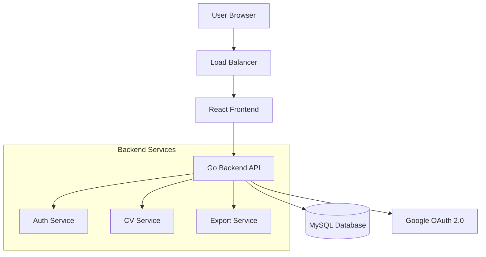
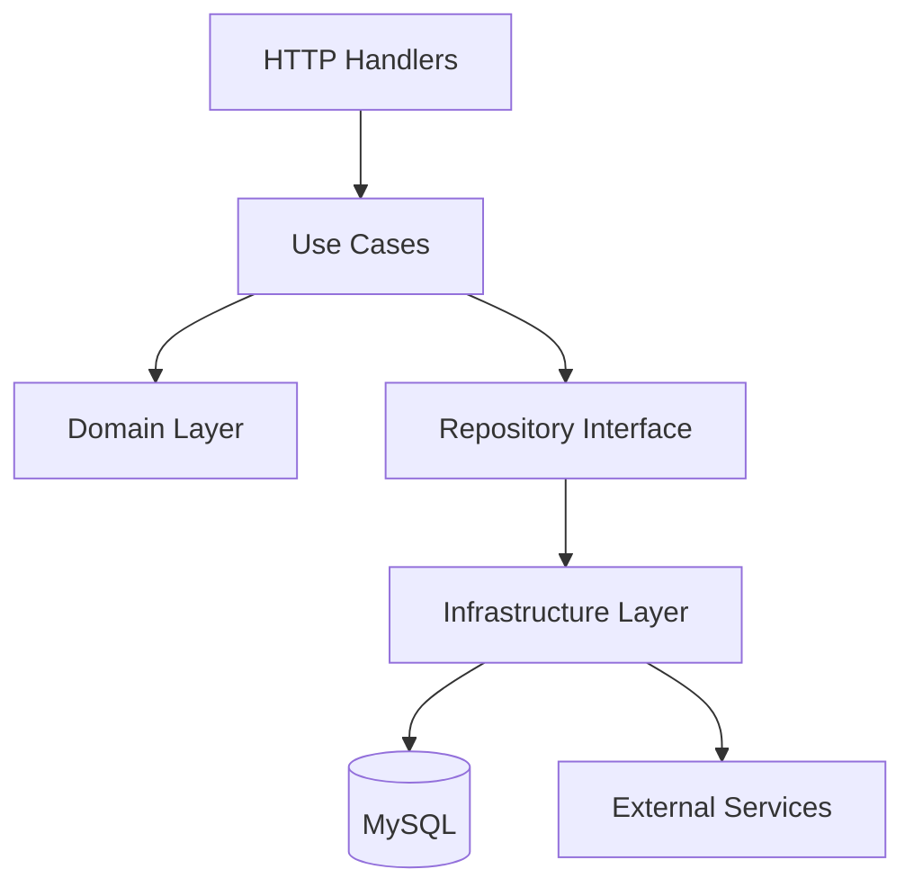

# Design Document

## Overview

WebエンジニアのCV管理システムは、Google OAuth 2.0認証を使用したWebアプリケーションです。ユーザーは自身のCV情報を登録・管理し、項目ごとに公開可否を設定できます。公開されたCV情報は、Web画面で閲覧可能です。

### Technology Stack

**Backend:**
- 言語: Go 1.25
- Webフレームワーク: Echo
- API仕様: OpenAPI 3.0.3
- OpenAPIライブラリ: kin-openapi (github.com/getkin/kin-openapi)
- コード生成: oapi-codegen (github.com/oapi-codegen/oapi-codegen)
- データベースアクセス: sqlc
- データベースマイグレーション: sqldef
- データベース: MySQL 8.0+
- 認証: Google OAuth 2.0 (golang.org/x/oauth2)
- 環境変数管理: envconfig (github.com/vrischmann/envconfig)
- ローカル環境変数: godotenv (github.com/joho/godotenv)
- タスクランナー: Makefile

**Frontend:**
- フレームワーク: React 18+ with TypeScript
- UIライブラリ: shadcn/ui
- 状態管理: Jotai
- ルーティング: TanStack Router
- HTTPクライアント: ky (github.com/sindresorhus/ky)

**Infrastructure:**
- コンテナ: Docker
- オーケストレーション: Docker Compose (開発環境)
- クラウド: Google Cloud Platform (本番環境)
  - Cloud Run (アプリケーション)
  - Cloud SQL (MySQL)

## Architecture

### System Architecture



### Backend Architecture (Clean Architecture)



**レイヤー構成:**

1. **Domain Layer** (`internal/domain`)
   - エンティティとビジネスロジック
   - リポジトリインターフェース定義
   - ドメインサービス

2. **Use Case Layer** (`internal/usecase`)
   - アプリケーションロジック
   - ユースケースの実装
   - トランザクション管理

3. **Interface Layer** (`internal/interface`)
   - HTTPハンドラー
   - リクエスト/レスポンスDTO
   - ミドルウェア

4. **Infrastructure Layer** (`internal/infrastructure`)
   - データベース実装
   - 外部サービス連携
   - 設定管理

## Components and Interfaces

### Backend Components

#### 1. Authentication Module

**責務:** Google OAuth 2.0認証とユーザー管理

**主要コンポーネント:**

```go
// Domain Entity
type User struct {
    ID            string
    Email         string
    Name          string
    GoogleID      string
    ProfileImage  string
    CreatedAt     time.Time
    UpdatedAt     time.Time
}

// Repository Interface
type UserRepository interface {
    Create(ctx context.Context, user *User) error
    FindByID(ctx context.Context, id string) (*User, error)
    FindByGoogleID(ctx context.Context, googleID string) (*User, error)
    FindByEmail(ctx context.Context, email string) (*User, error)
}

// Use Case
type AuthUseCase interface {
    GoogleLogin(ctx context.Context, code string) (*AuthResponse, error)
    GetCurrentUser(ctx context.Context, userID string) (*User, error)
    Logout(ctx context.Context, userID string) error
}
```

#### 2. CV Management Module

**責務:** CV情報の登録、更新、取得

**主要コンポーネント:**

```go
// Domain Entities
type CV struct {
    ID              string
    UserID          string
    IsPublic        bool
    PublicURL       string
    BasicInfo       BasicInfo
    CreatedAt       time.Time
    UpdatedAt       time.Time
}

type BasicInfo struct {
    FullName       string
    Email          string
    Phone          string
    Address        string
    DateOfBirth    time.Time
    // 各フィールドの公開設定
    ShowEmail      bool
    ShowPhone      bool
    ShowAddress    bool
    ShowDOB        bool
}

type WorkExperience struct {
    ID             string
    CVID           string
    CompanyName    string
    Position       string
    StartDate      time.Time
    EndDate        *time.Time
    Description    string
    Technologies   string // JSON array
    IsPublic       bool
    DisplayOrder   int
    CreatedAt      time.Time
    UpdatedAt      time.Time
}

type Skill struct {
    ID             string
    CVID           string
    Name           string
    Level          string // Beginner, Intermediate, Advanced, Expert
    YearsOfExp     int
    IsPublic       bool
    DisplayOrder   int
    CreatedAt      time.Time
    UpdatedAt      time.Time
}

type Education struct {
    ID             string
    CVID           string
    SchoolName     string
    Degree         string
    FieldOfStudy   string
    StartDate      time.Time
    EndDate        *time.Time
    IsPublic       bool
    DisplayOrder   int
    CreatedAt      time.Time
    UpdatedAt      time.Time
}

type Certification struct {
    ID             string
    CVID           string
    Name           string
    IssuingOrg     string
    IssueDate      time.Time
    ExpiryDate     *time.Time
    CredentialID   string
    IsPublic       bool
    DisplayOrder   int
    CreatedAt      time.Time
    UpdatedAt      time.Time
}

type Project struct {
    ID             string
    CVID           string
    Name           string
    Role           string
    StartDate      time.Time
    EndDate        *time.Time
    Description    string
    Technologies   string // JSON array
    IsPublic       bool
    DisplayOrder   int
    CreatedAt      time.Time
    UpdatedAt      time.Time
}

// Repository Interface
type CVRepository interface {
    Create(ctx context.Context, cv *CV) error
    Update(ctx context.Context, cv *CV) error
    FindByID(ctx context.Context, id string) (*CV, error)
    FindByUserID(ctx context.Context, userID string) (*CV, error)
    FindByPublicURL(ctx context.Context, url string) (*CV, error)
    
    // Work Experience
    CreateWorkExperience(ctx context.Context, exp *WorkExperience) error
    UpdateWorkExperience(ctx context.Context, exp *WorkExperience) error
    DeleteWorkExperience(ctx context.Context, id string) error
    ListWorkExperiences(ctx context.Context, cvID string) ([]*WorkExperience, error)
    
    // Skills
    CreateSkill(ctx context.Context, skill *Skill) error
    UpdateSkill(ctx context.Context, skill *Skill) error
    DeleteSkill(ctx context.Context, id string) error
    ListSkills(ctx context.Context, cvID string) ([]*Skill, error)
    
    // Education
    CreateEducation(ctx context.Context, edu *Education) error
    UpdateEducation(ctx context.Context, edu *Education) error
    DeleteEducation(ctx context.Context, id string) error
    ListEducations(ctx context.Context, cvID string) ([]*Education, error)
    
    // Certifications
    CreateCertification(ctx context.Context, cert *Certification) error
    UpdateCertification(ctx context.Context, cert *Certification) error
    DeleteCertification(ctx context.Context, id string) error
    ListCertifications(ctx context.Context, cvID string) ([]*Certification, error)
    
    // Projects
    CreateProject(ctx context.Context, proj *Project) error
    UpdateProject(ctx context.Context, proj *Project) error
    DeleteProject(ctx context.Context, id string) error
    ListProjects(ctx context.Context, cvID string) ([]*Project, error)
}

// Use Case
type CVUseCase interface {
    CreateCV(ctx context.Context, userID string, req *CreateCVRequest) (*CVResponse, error)
    UpdateCV(ctx context.Context, userID string, cvID string, req *UpdateCVRequest) (*CVResponse, error)
    GetMyCV(ctx context.Context, userID string) (*CVResponse, error)
    GetPublicCV(ctx context.Context, publicURL string) (*PublicCVResponse, error)
    
    SetPublicStatus(ctx context.Context, userID string, cvID string, isPublic bool) error
    GeneratePublicURL(ctx context.Context, userID string, cvID string) (string, error)
    
    // Work Experience Management
    AddWorkExperience(ctx context.Context, userID string, cvID string, req *WorkExperienceRequest) error
    UpdateWorkExperience(ctx context.Context, userID string, expID string, req *WorkExperienceRequest) error
    DeleteWorkExperience(ctx context.Context, userID string, expID string) error
    
    // Similar methods for Skills, Education, Certifications, Projects...
}
```

### Frontend Components

#### 1. Authentication Components
- `LoginPage`: Google OAuth認証画面
- `AuthCallback`: OAuth認証後のコールバック処理
- `ProtectedRoute`: 認証が必要なルートの保護

#### 2. CV Management Components
- `Dashboard`: ユーザーダッシュボード
- `CVEditor`: CV編集画面
  - `BasicInfoForm`: 基本情報入力
  - `WorkExperienceForm`: 職務経歴入力
  - `SkillsForm`: スキル入力
  - `EducationForm`: 学歴入力
  - `CertificationForm`: 資格入力
  - `ProjectForm`: プロジェクト実績入力
- `CVPreview`: CV プレビュー画面
- `PublicCVView`: 公開CV閲覧画面

#### 3. Public URL Management Components
- `PublicURLManager`: 公開URL管理

### API Endpoints

```
# Authentication
POST   /api/v1/auth/google/login      # Google OAuth開始
GET    /api/v1/auth/google/callback   # OAuth コールバック
POST   /api/v1/auth/logout            # ログアウト
GET    /api/v1/auth/me                # 現在のユーザー情報取得

# CV Management
POST   /api/v1/cv                     # CV作成
GET    /api/v1/cv/my                  # 自分のCV取得
PUT    /api/v1/cv/:id                 # CV更新
PUT    /api/v1/cv/:id/public          # 公開設定変更
POST   /api/v1/cv/:id/public-url      # 公開URL生成

# Work Experience
POST   /api/v1/cv/:id/work-experience           # 職務経歴追加
PUT    /api/v1/cv/:id/work-experience/:exp_id   # 職務経歴更新
DELETE /api/v1/cv/:id/work-experience/:exp_id   # 職務経歴削除

# Skills
POST   /api/v1/cv/:id/skills           # スキル追加
PUT    /api/v1/cv/:id/skills/:skill_id # スキル更新
DELETE /api/v1/cv/:id/skills/:skill_id # スキル削除

# Education
POST   /api/v1/cv/:id/education           # 学歴追加
PUT    /api/v1/cv/:id/education/:edu_id   # 学歴更新
DELETE /api/v1/cv/:id/education/:edu_id   # 学歴削除

# Certifications
POST   /api/v1/cv/:id/certifications           # 資格追加
PUT    /api/v1/cv/:id/certifications/:cert_id  # 資格更新
DELETE /api/v1/cv/:id/certifications/:cert_id  # 資格削除

# Projects
POST   /api/v1/cv/:id/projects           # プロジェクト追加
PUT    /api/v1/cv/:id/projects/:proj_id  # プロジェクト更新
DELETE /api/v1/cv/:id/projects/:proj_id  # プロジェクト削除

# Public Access
GET    /api/v1/public/cv/:public_url   # 公開CV取得
```

## Data Models

### Database Schema

```sql
-- Users Table
CREATE TABLE users (
    id VARCHAR(36) PRIMARY KEY,
    email VARCHAR(255) UNIQUE NOT NULL,
    name VARCHAR(255) NOT NULL,
    google_id VARCHAR(255) UNIQUE NOT NULL,
    profile_image VARCHAR(512),
    created_at TIMESTAMP DEFAULT CURRENT_TIMESTAMP,
    updated_at TIMESTAMP DEFAULT CURRENT_TIMESTAMP ON UPDATE CURRENT_TIMESTAMP,
    INDEX idx_email (email),
    INDEX idx_google_id (google_id)
);

-- CVs Table
CREATE TABLE cvs (
    id VARCHAR(36) PRIMARY KEY,
    user_id VARCHAR(36) NOT NULL,
    is_public BOOLEAN DEFAULT FALSE,
    public_url VARCHAR(255) UNIQUE,
    -- Basic Info (embedded)
    full_name VARCHAR(255),
    email VARCHAR(255),
    phone VARCHAR(50),
    address VARCHAR(512),
    date_of_birth DATE,
    show_email BOOLEAN DEFAULT TRUE,
    show_phone BOOLEAN DEFAULT TRUE,
    show_address BOOLEAN DEFAULT TRUE,
    show_dob BOOLEAN DEFAULT TRUE,
    created_at TIMESTAMP DEFAULT CURRENT_TIMESTAMP,
    updated_at TIMESTAMP DEFAULT CURRENT_TIMESTAMP ON UPDATE CURRENT_TIMESTAMP,
    FOREIGN KEY (user_id) REFERENCES users(id) ON DELETE CASCADE,
    INDEX idx_user_id (user_id),
    INDEX idx_public_url (public_url)
);

-- Work Experiences Table
CREATE TABLE work_experiences (
    id VARCHAR(36) PRIMARY KEY,
    cv_id VARCHAR(36) NOT NULL,
    company_name VARCHAR(255) NOT NULL,
    position VARCHAR(255) NOT NULL,
    start_date DATE NOT NULL,
    end_date DATE,
    description TEXT,
    technologies JSON,
    is_public BOOLEAN DEFAULT TRUE,
    display_order INT DEFAULT 0,
    created_at TIMESTAMP DEFAULT CURRENT_TIMESTAMP,
    updated_at TIMESTAMP DEFAULT CURRENT_TIMESTAMP ON UPDATE CURRENT_TIMESTAMP,
    FOREIGN KEY (cv_id) REFERENCES cvs(id) ON DELETE CASCADE,
    INDEX idx_cv_id (cv_id)
);

-- Skills Table
CREATE TABLE skills (
    id VARCHAR(36) PRIMARY KEY,
    cv_id VARCHAR(36) NOT NULL,
    name VARCHAR(255) NOT NULL,
    level VARCHAR(50),
    years_of_exp INT,
    is_public BOOLEAN DEFAULT TRUE,
    display_order INT DEFAULT 0,
    created_at TIMESTAMP DEFAULT CURRENT_TIMESTAMP,
    updated_at TIMESTAMP DEFAULT CURRENT_TIMESTAMP ON UPDATE CURRENT_TIMESTAMP,
    FOREIGN KEY (cv_id) REFERENCES cvs(id) ON DELETE CASCADE,
    INDEX idx_cv_id (cv_id)
);

-- Education Table
CREATE TABLE education (
    id VARCHAR(36) PRIMARY KEY,
    cv_id VARCHAR(36) NOT NULL,
    school_name VARCHAR(255) NOT NULL,
    degree VARCHAR(255),
    field_of_study VARCHAR(255),
    start_date DATE,
    end_date DATE,
    is_public BOOLEAN DEFAULT TRUE,
    display_order INT DEFAULT 0,
    created_at TIMESTAMP DEFAULT CURRENT_TIMESTAMP,
    updated_at TIMESTAMP DEFAULT CURRENT_TIMESTAMP ON UPDATE CURRENT_TIMESTAMP,
    FOREIGN KEY (cv_id) REFERENCES cvs(id) ON DELETE CASCADE,
    INDEX idx_cv_id (cv_id)
);

-- Certifications Table
CREATE TABLE certifications (
    id VARCHAR(36) PRIMARY KEY,
    cv_id VARCHAR(36) NOT NULL,
    name VARCHAR(255) NOT NULL,
    issuing_org VARCHAR(255),
    issue_date DATE,
    expiry_date DATE,
    credential_id VARCHAR(255),
    is_public BOOLEAN DEFAULT TRUE,
    display_order INT DEFAULT 0,
    created_at TIMESTAMP DEFAULT CURRENT_TIMESTAMP,
    updated_at TIMESTAMP DEFAULT CURRENT_TIMESTAMP ON UPDATE CURRENT_TIMESTAMP,
    FOREIGN KEY (cv_id) REFERENCES cvs(id) ON DELETE CASCADE,
    INDEX idx_cv_id (cv_id)
);

-- Projects Table
CREATE TABLE projects (
    id VARCHAR(36) PRIMARY KEY,
    cv_id VARCHAR(36) NOT NULL,
    name VARCHAR(255) NOT NULL,
    role VARCHAR(255),
    start_date DATE,
    end_date DATE,
    description TEXT,
    technologies JSON,
    is_public BOOLEAN DEFAULT TRUE,
    display_order INT DEFAULT 0,
    created_at TIMESTAMP DEFAULT CURRENT_TIMESTAMP,
    updated_at TIMESTAMP DEFAULT CURRENT_TIMESTAMP ON UPDATE CURRENT_TIMESTAMP,
    FOREIGN KEY (cv_id) REFERENCES cvs(id) ON DELETE CASCADE,
    INDEX idx_cv_id (cv_id)
);
```

## Error Handling

### Error Types

```go
type ErrorCode string

const (
    ErrCodeUnauthorized     ErrorCode = "UNAUTHORIZED"
    ErrCodeForbidden        ErrorCode = "FORBIDDEN"
    ErrCodeNotFound         ErrorCode = "NOT_FOUND"
    ErrCodeBadRequest       ErrorCode = "BAD_REQUEST"
    ErrCodeConflict         ErrorCode = "CONFLICT"
    ErrCodeInternalServer   ErrorCode = "INTERNAL_SERVER_ERROR"
    ErrCodeValidation       ErrorCode = "VALIDATION_ERROR"
)

type AppError struct {
    Code    ErrorCode `json:"code"`
    Message string    `json:"message"`
    Details any       `json:"details,omitempty"`
}
```

### Error Handling Strategy

1. **Domain Layer**: ドメインエラーを定義し、ビジネスルール違反を表現
2. **Use Case Layer**: ドメインエラーをアプリケーションエラーに変換
3. **Interface Layer**: HTTPステータスコードとエラーレスポンスにマッピング
4. **Frontend**: エラーメッセージをユーザーフレンドリーに表示

### HTTP Status Code Mapping

- 200 OK: 成功
- 201 Created: リソース作成成功
- 400 Bad Request: バリデーションエラー
- 401 Unauthorized: 認証エラー
- 403 Forbidden: 権限エラー
- 404 Not Found: リソースが見つからない
- 409 Conflict: リソースの競合
- 500 Internal Server Error: サーバーエラー

## Testing Strategy

### Backend Testing

#### 1. Unit Tests
- **対象**: Domain層、UseCase層の個別関数
- **ツール**: Go標準testing、testify/assert
- **カバレッジ目標**: 80%以上
- **テスト内容**:
  - ビジネスロジックの検証
  - バリデーションロジックの検証
  - エラーハンドリングの検証

#### 2. Integration Tests
- **対象**: Repository層、外部サービス連携
- **ツール**: testcontainers-go (MySQL)
- **テスト内容**:
  - データベース操作の検証
  - トランザクション処理の検証
  - OAuth認証フローの検証

#### 3. API Tests
- **対象**: HTTPハンドラー、エンドツーエンド
- **ツール**: httptest、testify
- **テスト内容**:
  - APIエンドポイントの動作検証
  - 認証・認可の検証
  - レスポンス形式の検証

### Frontend Testing

#### 1. Unit Tests
- **対象**: ユーティリティ関数、カスタムフック
- **ツール**: Jest、React Testing Library
- **カバレッジ目標**: 70%以上

#### 2. Component Tests
- **対象**: Reactコンポーネント
- **ツール**: React Testing Library
- **テスト内容**:
  - コンポーネントのレンダリング検証
  - ユーザーインタラクションの検証
  - 状態管理の検証

#### 3. E2E Tests
- **対象**: ユーザーフロー全体
- **ツール**: Playwright
- **テスト内容**:
  - ログインフロー
  - CV作成・編集フロー
  - CV公開フロー

### Test Data Management

- **Fixtures**: テストデータをJSONファイルで管理
- **Factories**: テストデータ生成用のファクトリー関数
- **Seeders**: 開発環境用のシードデータ

## Security Considerations

### Authentication & Authorization
- Google OAuth 2.0による認証
- JWTトークンによるセッション管理
- トークンの有効期限管理（アクセストークン: 1時間、リフレッシュトークン: 7日間）
- ユーザーは自分のCV情報のみアクセス可能

### Data Protection
- パスワードは保存しない（OAuth認証のみ）
- 個人情報の暗号化（データベース暗号化）
- HTTPS通信の強制
- CORS設定による不正アクセス防止

### Input Validation
- すべての入力データのバリデーション
- SQLインジェクション対策（ORMの使用）
- XSS対策（入力のサニタイズ）
- CSRFトークンの使用

### Rate Limiting
- API呼び出しのレート制限
- ログイン試行回数の制限
- Export機能の呼び出し制限

## Performance Considerations

### Backend Optimization
- データベースインデックスの最適化
- N+1クエリ問題の回避（Eager Loading）
- キャッシング戦略（Redis）
- ページネーション実装

### Frontend Optimization
- コード分割（React.lazy）
- 画像の最適化
- APIレスポンスのキャッシング（React Query）
- 仮想スクロール（大量データ表示時）

## Deployment Strategy

### Development Environment
- Docker Composeによるローカル環境構築
- ホットリロード対応
- モックデータの使用

### Staging Environment
- Google Cloud Runへのデプロイ
- Cloud SQLの使用
- 本番環境と同等の構成

### Production Environment
- Google Cloud Runでのオートスケーリング
- Cloud SQLのHA構成
- Cloud CDNの使用
- Cloud Monitoringによる監視
- Cloud Loggingによるログ管理

### CI/CD Pipeline
- GitHub Actionsによる自動テスト
- 自動デプロイ（mainブランチへのマージ時）
- ロールバック機能
- データベースマイグレーション自動実行
