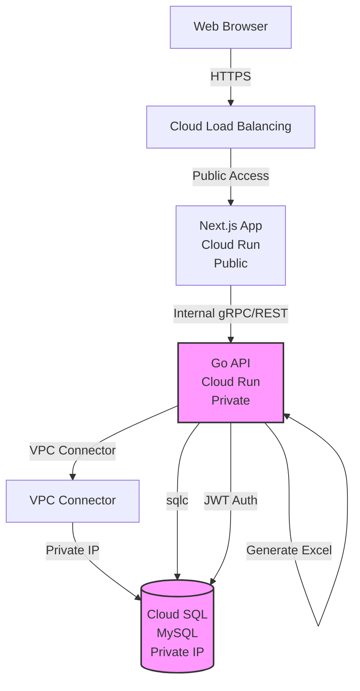

# Design Document

## Overview

WebエンジニアのCV管理システムは、Next.js（App Router）をフロントエンドに、GolangのWeb APIをバックエンドに使用し、MySQLをデータベースとして採用します。Google Cloud上に構築され、認証機能、CV情報の登録・編集、公開情報の選択、Web表示、Excel出力の機能を提供します。

### Technology Stack

**Frontend**
- Next.js 14+ (App Router), React, TypeScript
- Material-UI (MUI) - デザインシステム
- TanStack Query (データフェッチング・キャッシング)
- React Hook Form (フォーム管理)
- Zod (バリデーション)
- NextAuth.js (Google OAuth認証)

**Backend**
- Go 1.23+ (最新安定版)
- Echo v4 (Webフレームワーク)
- sqlc (型安全なSQLクエリ生成)
- Connect (gRPC/gRPC-Web)
- OAuth 2.0 / Google Identity Platform (認証)
- excelize (Excel生成)
- sqldef (データベーススキーマ管理)

**Database**
- Cloud SQL for MySQL 8.0+

**Infrastructure (Google Cloud)**
- Cloud Run (フロントエンド・バックエンドのホスティング)
  - Frontend: パブリックアクセス
  - Backend: プライベート（Frontendからのみアクセス可能）
- Cloud SQL (MySQL、プライベートIP)
- Cloud Storage (将来的なファイルストレージ用)
- VPC Connector (Cloud RunとCloud SQL間の接続)
- Cloud Load Balancing (Frontend用)
- Cloud Armor (セキュリティ)

**Development & Deployment**
- Docker (コンテナ化)
- Terraform (インフラ構築・管理)
- GitHub Actions (CI/CD)
- Artifact Registry (コンテナイメージ管理)

## Architecture

### System Architecture



### Application Layers (Clean Architecture)

**Frontend (Next.js) - Clean Architecture**
```
src/
├── app/                    # Next.js App Router (Frameworks & Drivers)
├── components/             # UI Components (Interface Adapters)
├── features/              # Feature modules
│   ├── auth/
│   │   ├── domain/        # Entities & Use Cases
│   │   ├── application/   # Use Case implementations
│   │   ├── infrastructure/# API clients, repositories
│   │   └── presentation/  # Components, hooks
│   └── cv/
│       ├── domain/
│       ├── application/
│       ├── infrastructure/
│       └── presentation/
└── shared/                # Shared utilities
```

**Layers:**
1. **Domain Layer**: Entities, Value Objects, Domain Services
2. **Application Layer**: Use Cases, DTOs
3. **Infrastructure Layer**: API clients (Connect/REST), State management (TanStack Query)
4. **Presentation Layer**: React Components (MUI), Forms (React Hook Form + Zod)

**Backend (Go) - Clean Architecture**
```
backend/
├── cmd/
│   └── api/              # Application entry point
├── internal/
│   ├── domain/           # Entities (Enterprise Business Rules)
│   │   ├── user/
│   │   ├── cv/
│   │   └── auth/
│   ├── usecase/          # Use Cases (Application Business Rules)
│   │   ├── user/
│   │   ├── cv/
│   │   └── auth/
│   ├── interface/        # Interface Adapters
│   │   ├── handler/      # HTTP/gRPC handlers (Echo + Connect)
│   │   ├── presenter/    # Response formatters
│   │   └── middleware/   # Auth, logging, etc.
│   └── infrastructure/   # Frameworks & Drivers
│       ├── repository/   # Data access (sqlc)
│       ├── external/     # External services (Google OAuth)
│       └── config/       # Configuration
├── pkg/                  # Public libraries
└── proto/                # Protocol Buffers definitions
```

**Layers:**
1. **Domain Layer (Entities)**: ビジネスロジックの中核、依存なし
2. **Use Case Layer**: アプリケーション固有のビジネスルール
3. **Interface Adapters**: Controllers (handlers), Presenters, Gateways
4. **Frameworks & Drivers**: Echo, Connect, sqlc, MySQL

**Dependency Rule:**
- 依存の方向: Frameworks → Interface Adapters → Use Cases → Entities
- 内側の層は外側の層を知らない
- インターフェースを使用して依存性を逆転

### Network Architecture

- **Frontend Cloud Run**: `--ingress=all` (パブリックアクセス)
- **Backend Cloud Run**: `--ingress=internal` (内部アクセスのみ)
- **Cloud SQL**: プライベートIP接続
- **VPC Connector**: Cloud RunとCloud SQL間の接続
- Frontend → Backend: サービス間認証（Service Account）

## Components and Interfaces

### 1. Authentication Module

#### Frontend Components (Next.js)
- `GoogleSignInButton`: Google OAuth認証ボタンコンポーネント
- `AuthProvider`: NextAuth.jsを使用した認証状態管理プロバイダー
- `ProtectedRoute`: 認証が必要なページを保護するラッパー

#### Frontend Authentication (NextAuth.js)
- Google OAuth Provider設定
- セッション管理
- 認証コールバック処理

#### Backend API Endpoints (Go/Echo)
- `GET /api/auth/callback`: Google OAuth コールバック処理
- `POST /api/auth/verify`: Google ID Token検証
- `GET /api/auth/me`: 現在のユーザー情報取得
- `POST /api/auth/logout`: ログアウト

#### Backend gRPC Services (Connect)
```protobuf
service AuthService {
  rpc VerifyGoogleToken(VerifyGoogleTokenRequest) returns (VerifyGoogleTokenResponse);
  rpc GetMe(GetMeRequest) returns (GetMeResponse);
  rpc Logout(LogoutRequest) returns (LogoutResponse);
}

message VerifyGoogleTokenRequest {
  string id_token = 1;
}

message VerifyGoogleTokenResponse {
  string access_token = 1;
  int64 expires_in = 2;
  User user = 3;
}
```

#### Backend Services (Go) - Clean Architecture

**Domain Layer (Entities)**
```go
// internal/domain/user/entity.go
type User struct {
    ID        string
    GoogleID  string
    Email     string
    Name      string
    Picture   string
    Role      UserRole
    CreatedAt time.Time
    UpdatedAt time.Time
}

// internal/domain/user/repository.go (Interface)
type Repository interface {
    FindByID(ctx context.Context, id string) (*User, error)
    FindByGoogleID(ctx context.Context, googleID string) (*User, error)
    Create(ctx context.Context, user *User) error
    Update(ctx context.Context, user *User) error
}
```

**Use Case Layer**
```go
// internal/usecase/auth/usecase.go
type UseCase interface {
    VerifyGoogleToken(ctx context.Context, idToken string) (*AuthResponse, error)
    GetOrCreateUser(ctx context.Context, googleUser *GoogleUserInfo) (*User, error)
}

type usecase struct {
    userRepo user.Repository
    tokenService TokenService
    googleClient GoogleClient
}

func (u *usecase) VerifyGoogleToken(ctx context.Context, idToken string) (*AuthResponse, error) {
    // Use case implementation
}
```

**Interface Adapters (Handler)**
```go
// internal/interface/handler/auth_handler.go
type AuthHandler struct {
    authUseCase auth.UseCase
}

func (h *AuthHandler) VerifyGoogleToken(c echo.Context) error {
    // HTTP handler implementation
}
```

**Infrastructure Layer (Repository)**
```go
// internal/infrastructure/repository/user_repository.go
type userRepository struct {
    db *sql.DB
    queries *db.Queries // sqlc generated
}

func (r *userRepository) FindByID(ctx context.Context, id string) (*user.User, error) {
    // sqlc implementation
}
```

### 2. User Management Module

#### Frontend Components (Next.js)
- `UserList`: ユーザー一覧表示（システムオーナーのみ）
- `UserForm`: ユーザー登録・編集フォーム

#### Backend API Endpoints (Go/Echo)
- `GET /api/users`: ユーザー一覧取得
- `GET /api/users/:id`: ユーザー詳細取得
- `POST /api/users`: ユーザー登録
- `PUT /api/users/:id`: ユーザー更新
- `DELETE /api/users/:id`: ユーザー削除

#### Backend gRPC Services (Connect)
```protobuf
service UserService {
  rpc ListUsers(ListUsersRequest) returns (ListUsersResponse);
  rpc GetUser(GetUserRequest) returns (GetUserResponse);
  rpc CreateUser(CreateUserRequest) returns (CreateUserResponse);
  rpc UpdateUser(UpdateUserRequest) returns (UpdateUserResponse);
  rpc DeleteUser(DeleteUserRequest) returns (DeleteUserResponse);
}
```

#### Backend Services (Go) - Clean Architecture

**Use Case Layer**
```go
// internal/usecase/user/usecase.go
type UseCase interface {
    GetUsers(ctx context.Context) ([]user.User, error)
    GetUserByID(ctx context.Context, id string) (*user.User, error)
    CreateUser(ctx context.Context, input CreateUserInput) (*user.User, error)
    UpdateUser(ctx context.Context, id string, input UpdateUserInput) (*user.User, error)
    DeleteUser(ctx context.Context, id string) error
}
```

### 3. CV Management Module

#### Frontend Components (Next.js)
- `CVList`: CV一覧表示
- `CVForm`: CV登録・編集フォーム
  - `BasicInfoSection`: 基本情報セクション
  - `WorkExperienceSection`: 職務経歴セクション
  - `SkillsSection`: スキルセクション
  - `EducationSection`: 学歴セクション
  - `CertificationSection`: 資格セクション
  - `ProjectSection`: プロジェクト実績セクション
- `VisibilityToggle`: 公開/非公開切り替えコンポーネント

#### Backend API Endpoints (Go/Echo)
- `GET /api/cvs`: CV一覧取得
- `GET /api/cvs/:id`: CV詳細取得
- `POST /api/cvs`: CV登録
- `PUT /api/cvs/:id`: CV更新
- `DELETE /api/cvs/:id`: CV削除

#### Backend gRPC Services (Connect)
```protobuf
service CVService {
  rpc ListCVs(ListCVsRequest) returns (ListCVsResponse);
  rpc GetCV(GetCVRequest) returns (GetCVResponse);
  rpc CreateCV(CreateCVRequest) returns (CreateCVResponse);
  rpc UpdateCV(UpdateCVRequest) returns (UpdateCVResponse);
  rpc DeleteCV(DeleteCVRequest) returns (DeleteCVResponse);
}
```

#### Backend Services (Go) - Clean Architecture

**Use Case Layer**
```go
// internal/usecase/cv/usecase.go
type UseCase interface {
    GetCVList(ctx context.Context, userID string, role user.UserRole) ([]cv.CV, error)
    GetCVByID(ctx context.Context, id string, includePrivate bool) (*cv.CV, error)
    CreateCV(ctx context.Context, input CreateCVInput) (*cv.CV, error)
    UpdateCV(ctx context.Context, id string, input UpdateCVInput) (*cv.CV, error)
    DeleteCV(ctx context.Context, id string) error
}

// internal/domain/cv/service.go (Domain Service)
type Service interface {
    FilterPublicFields(cv *CV) *CV
}
```

### 4. Web Display Module

#### Frontend Components (Next.js)
- `CVDetailView`: CV詳細表示画面
  - `BasicInfoDisplay`: 基本情報表示
  - `WorkExperienceDisplay`: 職務経歴表示
  - `SkillsDisplay`: スキル表示
  - `EducationDisplay`: 学歴表示
  - `CertificationDisplay`: 資格表示
  - `ProjectDisplay`: プロジェクト実績表示

#### Features
- レスポンシブデザイン
- 印刷最適化
- 公開設定に基づいた条件付き表示
- Server-Side Rendering (SSR) for SEO

### 5. Excel Export Module

#### Backend API Endpoints (Go/Echo)
- `GET /api/cvs/:id/export/excel`: 単一CV Excel出力
- `POST /api/cvs/export/excel/bulk`: 複数CV一括Excel出力

#### Backend gRPC Services (Connect)
```protobuf
service ExcelExportService {
  rpc ExportCV(ExportCVRequest) returns (ExportCVResponse);
  rpc ExportMultipleCVs(ExportMultipleCVsRequest) returns (ExportMultipleCVsResponse);
}

message ExportCVResponse {
  bytes file_data = 1;
  string filename = 2;
}
```

#### Backend Services (Go) - Clean Architecture

**Use Case Layer**
```go
// internal/usecase/export/usecase.go
type UseCase interface {
    ExportSingleCV(ctx context.Context, cvID string) ([]byte, error)
    ExportMultipleCVs(ctx context.Context, cvIDs []string) ([]byte, error)
}

// internal/infrastructure/excel/formatter.go (Infrastructure)
type Formatter interface {
    FormatCVForExcel(cv *cv.CV) (*excelize.File, error)
}
```

#### Excel Structure
- **Sheet 1: 基本情報** - 氏名、連絡先など
- **Sheet 2: 職務経歴** - 会社名、期間、業務内容
- **Sheet 3: スキル** - 技術スタック、習熟度
- **Sheet 4: 学歴・資格** - 学歴、資格情報
- **Sheet 5: プロジェクト実績** - プロジェクト詳細

## Data Models

### User Model

```go
type User struct {
    ID        string    `json:"id"`
    GoogleID  string    `json:"google_id"`
    Email     string    `json:"email"`
    Name      string    `json:"name"`
    Picture   string    `json:"picture"`
    Role      UserRole  `json:"role"`
    CreatedAt time.Time `json:"created_at"`
    UpdatedAt time.Time `json:"updated_at"`
}

type UserRole string

const (
    RoleSystemOwner  UserRole = "SYSTEM_OWNER"
    RoleGeneralUser  UserRole = "GENERAL_USER"
)
```

### CV Model

```go
type CV struct {
    ID              string            `json:"id"`
    UserID          string            `json:"user_id"`
    BasicInfo       *BasicInfo        `json:"basic_info,omitempty"`
    WorkExperiences []WorkExperience  `json:"work_experiences,omitempty"`
    Skills          []Skill           `json:"skills,omitempty"`
    Educations      []Education       `json:"educations,omitempty"`
    Certifications  []Certification   `json:"certifications,omitempty"`
    Projects        []Project         `json:"projects,omitempty"`
    CreatedAt       time.Time         `json:"created_at"`
    UpdatedAt       time.Time         `json:"updated_at"`
}

type BasicInfo struct {
    ID              string `json:"id"`
    CVID            string `json:"cv_id"`
    FullName        string `json:"full_name"`
    FullNameVisible bool   `json:"full_name_visible"`
    Email           string `json:"email"`
    EmailVisible    bool   `json:"email_visible"`
    Phone           string `json:"phone"`
    PhoneVisible    bool   `json:"phone_visible"`
    Address         string `json:"address"`
    AddressVisible  bool   `json:"address_visible"`
    Summary         string `json:"summary"`
    SummaryVisible  bool   `json:"summary_visible"`
}

type WorkExperience struct {
    ID           string     `json:"id"`
    CVID         string     `json:"cv_id"`
    CompanyName  string     `json:"company_name"`
    Position     string     `json:"position"`
    StartDate    time.Time  `json:"start_date"`
    EndDate      *time.Time `json:"end_date,omitempty"`
    Description  string     `json:"description"`
    Technologies string     `json:"technologies"` // JSON string
    Visible      bool       `json:"visible"`
    Order        int        `json:"order"`
}

type Skill struct {
    ID                string `json:"id"`
    CVID              string `json:"cv_id"`
    Name              string `json:"name"`
    Category          string `json:"category"`
    Proficiency       string `json:"proficiency"`
    YearsOfExperience int    `json:"years_of_experience"`
    Visible           bool   `json:"visible"`
    Order             int    `json:"order"`
}

type Education struct {
    ID           string     `json:"id"`
    CVID         string     `json:"cv_id"`
    SchoolName   string     `json:"school_name"`
    Degree       string     `json:"degree"`
    FieldOfStudy string     `json:"field_of_study"`
    StartDate    time.Time  `json:"start_date"`
    EndDate      *time.Time `json:"end_date,omitempty"`
    Visible      bool       `json:"visible"`
    Order        int        `json:"order"`
}

type Certification struct {
    ID                  string     `json:"id"`
    CVID                string     `json:"cv_id"`
    Name                string     `json:"name"`
    IssuingOrganization string     `json:"issuing_organization"`
    IssueDate           time.Time  `json:"issue_date"`
    ExpirationDate      *time.Time `json:"expiration_date,omitempty"`
    CredentialID        string     `json:"credential_id"`
    Visible             bool       `json:"visible"`
    Order               int        `json:"order"`
}

type Project struct {
    ID           string     `json:"id"`
    CVID         string     `json:"cv_id"`
    Name         string     `json:"name"`
    Description  string     `json:"description"`
    Role         string     `json:"role"`
    StartDate    time.Time  `json:"start_date"`
    EndDate      *time.Time `json:"end_date,omitempty"`
    Technologies string     `json:"technologies"` // JSON string
    Achievements string     `json:"achievements"` // JSON string
    Visible      bool       `json:"visible"`
    Order        int        `json:"order"`
}
```

### Database Schema (MySQL)

sqlcを使用するため、マイグレーションファイルとクエリファイルを分離します。

#### Schema Definition (sqldef)

```sql
-- schema.sql
CREATE TABLE users (
    id VARCHAR(36) PRIMARY KEY,
    google_id VARCHAR(255) UNIQUE NOT NULL,
    email VARCHAR(255) UNIQUE NOT NULL,
    name VARCHAR(255) NOT NULL,
    picture VARCHAR(512),
    role VARCHAR(20) NOT NULL DEFAULT 'GENERAL_USER',
    created_at TIMESTAMP DEFAULT CURRENT_TIMESTAMP,
    updated_at TIMESTAMP DEFAULT CURRENT_TIMESTAMP ON UPDATE CURRENT_TIMESTAMP,
    INDEX idx_google_id (google_id),
    INDEX idx_email (email)
);

CREATE TABLE cvs (
    id VARCHAR(36) PRIMARY KEY,
    user_id VARCHAR(36) UNIQUE NOT NULL,
    created_at TIMESTAMP DEFAULT CURRENT_TIMESTAMP,
    updated_at TIMESTAMP DEFAULT CURRENT_TIMESTAMP ON UPDATE CURRENT_TIMESTAMP,
    FOREIGN KEY (user_id) REFERENCES users(id) ON DELETE CASCADE,
    INDEX idx_user_id (user_id)
);

CREATE TABLE basic_infos (
    id VARCHAR(36) PRIMARY KEY,
    cv_id VARCHAR(36) UNIQUE NOT NULL,
    full_name VARCHAR(255) NOT NULL,
    full_name_visible BOOLEAN DEFAULT TRUE,
    email VARCHAR(255) NOT NULL,
    email_visible BOOLEAN DEFAULT TRUE,
    phone VARCHAR(50),
    phone_visible BOOLEAN DEFAULT TRUE,
    address TEXT,
    address_visible BOOLEAN DEFAULT FALSE,
    summary TEXT,
    summary_visible BOOLEAN DEFAULT TRUE,
    FOREIGN KEY (cv_id) REFERENCES cvs(id) ON DELETE CASCADE
);

CREATE TABLE work_experiences (
    id VARCHAR(36) PRIMARY KEY,
    cv_id VARCHAR(36) NOT NULL,
    company_name VARCHAR(255) NOT NULL,
    position VARCHAR(255) NOT NULL,
    start_date DATE NOT NULL,
    end_date DATE,
    description TEXT,
    technologies JSON,
    visible BOOLEAN DEFAULT TRUE,
    `order` INT NOT NULL,
    FOREIGN KEY (cv_id) REFERENCES cvs(id) ON DELETE CASCADE,
    INDEX idx_cv_id (cv_id)
);

CREATE TABLE skills (
    id VARCHAR(36) PRIMARY KEY,
    cv_id VARCHAR(36) NOT NULL,
    name VARCHAR(255) NOT NULL,
    category VARCHAR(20),
    proficiency VARCHAR(20),
    years_of_experience INT,
    visible BOOLEAN DEFAULT TRUE,
    `order` INT NOT NULL,
    FOREIGN KEY (cv_id) REFERENCES cvs(id) ON DELETE CASCADE,
    INDEX idx_cv_id (cv_id)
);

CREATE TABLE educations (
    id VARCHAR(36) PRIMARY KEY,
    cv_id VARCHAR(36) NOT NULL,
    school_name VARCHAR(255) NOT NULL,
    degree VARCHAR(255),
    field_of_study VARCHAR(255),
    start_date DATE NOT NULL,
    end_date DATE,
    visible BOOLEAN DEFAULT TRUE,
    `order` INT NOT NULL,
    FOREIGN KEY (cv_id) REFERENCES cvs(id) ON DELETE CASCADE,
    INDEX idx_cv_id (cv_id)
);

CREATE TABLE certifications (
    id VARCHAR(36) PRIMARY KEY,
    cv_id VARCHAR(36) NOT NULL,
    name VARCHAR(255) NOT NULL,
    issuing_organization VARCHAR(255),
    issue_date DATE NOT NULL,
    expiration_date DATE,
    credential_id VARCHAR(255),
    visible BOOLEAN DEFAULT TRUE,
    `order` INT NOT NULL,
    FOREIGN KEY (cv_id) REFERENCES cvs(id) ON DELETE CASCADE,
    INDEX idx_cv_id (cv_id)
);

CREATE TABLE projects (
    id VARCHAR(36) PRIMARY KEY,
    cv_id VARCHAR(36) NOT NULL,
    name VARCHAR(255) NOT NULL,
    description TEXT,
    role VARCHAR(255),
    start_date DATE NOT NULL,
    end_date DATE,
    technologies JSON,
    achievements JSON,
    visible BOOLEAN DEFAULT TRUE,
    `order` INT NOT NULL,
    FOREIGN KEY (cv_id) REFERENCES cvs(id) ON DELETE CASCADE,
    INDEX idx_cv_id (cv_id)
);
```

#### sqldef Usage

```bash
# Dry run (変更内容の確認)
mysqldef -u user -p password -h host database < schema.sql --dry-run

# 実行
mysqldef -u user -p password -h host database < schema.sql
```

#### sqlc Configuration

```yaml
# sqlc.yaml
version: "2"
sql:
  - engine: "mysql"
    queries: "queries/"
    schema: "schema.sql"
    gen:
      go:
        package: "db"
        out: "internal/db"
        emit_json_tags: true
        emit_interface: true
        emit_empty_slices: true
```

## Error Handling

### Backend Error Types (Go)

```go
type AppError struct {
    StatusCode int    `json:"status_code"`
    Message    string `json:"message"`
    Code       string `json:"code"`
}

func (e *AppError) Error() string {
    return e.Message
}

var (
    ErrValidation      = &AppError{StatusCode: 400, Code: "VALIDATION_ERROR"}
    ErrAuthentication  = &AppError{StatusCode: 401, Code: "AUTHENTICATION_ERROR", Message: "Authentication failed"}
    ErrAuthorization   = &AppError{StatusCode: 403, Code: "AUTHORIZATION_ERROR", Message: "Access denied"}
    ErrNotFound        = &AppError{StatusCode: 404, Code: "NOT_FOUND"}
    ErrDatabase        = &AppError{StatusCode: 500, Code: "DATABASE_ERROR"}
    ErrInternal        = &AppError{StatusCode: 500, Code: "INTERNAL_ERROR"}
)
```

### Error Handling Strategy

**Backend (Go)**
1. **Middleware**: エラーハンドリングミドルウェアで統一的なエラーレスポンス
2. **Service Layer**: ビジネスロジックでのエラーをカスタムエラー型で返す
3. **Repository Layer**: データベースエラーをラップして返す
4. **Validation**: 構造体タグとバリデーターライブラリでリクエスト検証

**Frontend (Next.js)**
1. **API Client**: fetchエラーをキャッチして適切に処理
2. **Error Boundary**: UIレベルのエラーをキャッチ
3. **error.tsx**: ページレベルのエラーハンドリング
4. **Toast/Alert**: ユーザーフレンドリーなエラーメッセージ表示

### Error Response Format

```go
type ErrorResponse struct {
    Success bool   `json:"success"`
    Error   struct {
        Message string      `json:"message"`
        Code    string      `json:"code"`
        Details interface{} `json:"details,omitempty"`
    } `json:"error"`
}
```

## Testing Strategy

### Backend Testing (Go)

**Unit Testing**
- **Services**: ビジネスロジックの単体テスト
- **Repositories**: データアクセス層のテスト（モックDB使用）
- **Utilities**: ヘルパー関数のテスト

**Integration Testing**
- **API Handlers**: HTTPハンドラーの統合テスト
- **Database**: 実際のテストDBを使用したデータベース操作のテスト

**Testing Tools**
- testing (標準ライブラリ)
- testify (アサーションとモック)
- sqlmock (データベースモック)

### Frontend Testing (Next.js)

**Unit Testing**
- **Components**: Reactコンポーネントのテスト
- **Utilities**: ヘルパー関数のテスト
- **Hooks**: カスタムフックのテスト

**Integration Testing**
- **API Client**: APIクライアントのテスト（モックサーバー使用）

**E2E Testing**
- **User Flows**: 主要なユーザーフローのエンドツーエンドテスト
  - ログイン → CV作成 → 公開設定 → Web表示
  - ログイン → CV編集 → Excel出力

**Testing Tools**
- Jest
- React Testing Library
- Playwright (E2E)

## Security Considerations

### Authentication & Authorization
- Google OAuth 2.0による認証
- NextAuth.js（Frontend）でセッション管理
- Google ID Token検証（Backend）
- JWT（JSON Web Token）によるAPI認証
- ロールベースのアクセス制御（RBAC）
- ミドルウェアによる認証チェック

### Data Protection
- パスワードのハッシュ化（bcrypt）
- 環境変数での機密情報管理（Secret Manager使用）
- HTTPS通信の強制（Cloud Load Balancing）
- データベース接続の暗号化

### Input Validation
- 構造体タグによるバリデーション
- GORMによる型安全なクエリ
- SQLインジェクション対策（パラメータ化クエリ）
- XSS対策（フロントエンド: Reactの自動エスケープ）

### API Security
- CORS設定（適切なオリジン制限）
- レート制限の実装（ミドルウェア）
- Cloud Armorによるセキュリティポリシー
- リクエストサイズ制限

## Deployment Considerations

### Google Cloud Architecture

**Infrastructure as Code (Terraform)**
- すべてのGCPリソースをTerraformで管理
- 環境ごとの設定（dev, staging, production）
- State管理（Cloud Storage backend）

**Frontend (Next.js)**
- Cloud Run でホスティング
- Dockerfile でコンテナ化
- GitHub Actions で自動ビルド・デプロイ
- Artifact Registry でイメージ管理

**Backend (Go)**
- Cloud Run でホスティング（`--ingress=internal`でプライベート化）
- マルチステージビルドで最適化
- GitHub Actions で自動ビルド・デプロイ
- Artifact Registry でイメージ管理
- VPC Connector経由でCloud SQLに接続

**Database**
- Cloud SQL for MySQL
- プライベートIP接続
- 自動バックアップ設定
- レプリケーション（本番環境）

**Networking**
- Cloud Load Balancing（HTTPSロードバランサー、Frontend用）
- Cloud Armor（WAF）
- Cloud CDN（静的コンテンツ配信）
- VPC Connector（Cloud RunとCloud SQL間の接続）
- Backend Cloud Run: `--ingress=internal`（Frontendからのみアクセス可能）
- Service Account認証（Frontend → Backend間）

### Environment Variables

**Backend (Go)**
```env
DB_HOST=<Cloud SQL Private IP>
DB_PORT=3306
DB_USER=<database user>
DB_PASSWORD=<database password>
DB_NAME=cv_management
JWT_SECRET=<jwt secret key>
JWT_EXPIRATION=3600
GOOGLE_CLIENT_ID=<Google OAuth Client ID>
GOOGLE_CLIENT_SECRET=<Google OAuth Client Secret>
PORT=8080
ENVIRONMENT=production
```

**Frontend (Next.js)**
```env
NEXT_PUBLIC_API_URL=<Backend Cloud Run Internal URL>
NEXTAUTH_URL=<Frontend URL>
NEXTAUTH_SECRET=<NextAuth Secret>
GOOGLE_CLIENT_ID=<Google OAuth Client ID>
GOOGLE_CLIENT_SECRET=<Google OAuth Client Secret>
BACKEND_SERVICE_ACCOUNT=<Service Account for Backend access>
GOOGLE_CLOUD_PROJECT=<GCP Project ID>
```

### Database Migration
- sqldefを使用したスキーマ管理
- schema.sqlファイルに理想的なスキーマを定義
- sqldefが現在のDBと差分を検出して自動的にマイグレーション実行
- `--dry-run`オプションで実行前に変更内容を確認可能
- GitHub Actionsでのマイグレーション自動実行
- 本番環境へのマイグレーション戦略
  1. ステージング環境でテスト
  2. バックアップ取得
  3. dry-runで変更内容確認
  4. マイグレーション実行
  5. 検証

### Performance Optimization

**Backend**
- データベースコネクションプール
- 適切なインデックス設定
- クエリ最適化
- Gzipレスポンス圧縮

**Frontend**
- Server Components の活用
- 画像最適化（Next.js Image component）
- コード分割
- キャッシング戦略

### CI/CD Pipeline (GitHub Actions)

```yaml
# .github/workflows/deploy-backend.yml
name: Deploy Backend

on:
  push:
    branches: [main]
    paths:
      - 'backend/**'
      - '.github/workflows/deploy-backend.yml'

jobs:
  deploy:
    runs-on: ubuntu-latest
    permissions:
      contents: read
      id-token: write
    
    steps:
      - uses: actions/checkout@v4
      
      - id: auth
        uses: google-github-actions/auth@v2
        with:
          workload_identity_provider: ${{ secrets.WIF_PROVIDER }}
          service_account: ${{ secrets.WIF_SERVICE_ACCOUNT }}
      
      - name: Set up Cloud SDK
        uses: google-github-actions/setup-gcloud@v2
      
      - name: Configure Docker
        run: gcloud auth configure-docker asia-northeast1-docker.pkg.dev
      
      - name: Run Database Schema Migration
        run: |
          mysqldef -u ${{ secrets.DB_USER }} \
            -p ${{ secrets.DB_PASSWORD }} \
            -h ${{ secrets.DB_HOST }} \
            -P 3306 \
            ${{ secrets.DB_NAME }} \
            < backend/schema.sql
      
      - name: Build and Push Docker Image
        run: |
          docker build -t asia-northeast1-docker.pkg.dev/${{ secrets.GCP_PROJECT_ID }}/cv-management/cv-api:${{ github.sha }} backend/
          docker push asia-northeast1-docker.pkg.dev/${{ secrets.GCP_PROJECT_ID }}/cv-management/cv-api:${{ github.sha }}
      
      - name: Deploy to Cloud Run
        run: |
          gcloud run deploy cv-api \
            --image asia-northeast1-docker.pkg.dev/${{ secrets.GCP_PROJECT_ID }}/cv-management/cv-api:${{ github.sha }} \
            --region asia-northeast1 \
            --platform managed \
            --ingress internal \
            --vpc-connector cv-vpc-connector \
            --set-env-vars DB_HOST=${{ secrets.DB_HOST }},DB_PORT=3306,DB_NAME=${{ secrets.DB_NAME }} \
            --set-secrets DB_PASSWORD=db-password:latest,JWT_SECRET=jwt-secret:latest,GOOGLE_CLIENT_SECRET=google-client-secret:latest

# .github/workflows/deploy-frontend.yml
name: Deploy Frontend

on:
  push:
    branches: [main]
    paths:
      - 'frontend/**'
      - '.github/workflows/deploy-frontend.yml'

jobs:
  deploy:
    runs-on: ubuntu-latest
    permissions:
      contents: read
      id-token: write
    
    steps:
      - uses: actions/checkout@v4
      
      - id: auth
        uses: google-github-actions/auth@v2
        with:
          workload_identity_provider: ${{ secrets.WIF_PROVIDER }}
          service_account: ${{ secrets.WIF_SERVICE_ACCOUNT }}
      
      - name: Set up Cloud SDK
        uses: google-github-actions/setup-gcloud@v2
      
      - name: Configure Docker
        run: gcloud auth configure-docker asia-northeast1-docker.pkg.dev
      
      - name: Build and Push Docker Image
        run: |
          docker build -t asia-northeast1-docker.pkg.dev/${{ secrets.GCP_PROJECT_ID }}/cv-management/cv-frontend:${{ github.sha }} \
            --build-arg NEXT_PUBLIC_API_URL=${{ secrets.BACKEND_URL }} \
            frontend/
          docker push asia-northeast1-docker.pkg.dev/${{ secrets.GCP_PROJECT_ID }}/cv-management/cv-frontend:${{ github.sha }}
      
      - name: Deploy to Cloud Run
        run: |
          gcloud run deploy cv-frontend \
            --image asia-northeast1-docker.pkg.dev/${{ secrets.GCP_PROJECT_ID }}/cv-management/cv-frontend:${{ github.sha }} \
            --region asia-northeast1 \
            --platform managed \
            --ingress all \
            --allow-unauthenticated \
            --set-env-vars NEXT_PUBLIC_API_URL=${{ secrets.BACKEND_URL }} \
            --set-secrets NEXTAUTH_SECRET=nextauth-secret:latest,GOOGLE_CLIENT_SECRET=google-client-secret:latest

# .github/workflows/terraform.yml
name: Terraform

on:
  push:
    branches: [main]
    paths:
      - 'terraform/**'
      - '.github/workflows/terraform.yml'
  pull_request:
    branches: [main]
    paths:
      - 'terraform/**'

jobs:
  terraform:
    runs-on: ubuntu-latest
    permissions:
      contents: read
      id-token: write
      pull-requests: write
    
    steps:
      - uses: actions/checkout@v4
      
      - id: auth
        uses: google-github-actions/auth@v2
        with:
          workload_identity_provider: ${{ secrets.WIF_PROVIDER }}
          service_account: ${{ secrets.WIF_SERVICE_ACCOUNT }}
      
      - uses: hashicorp/setup-terraform@v3
      
      - name: Terraform Init
        run: terraform init
        working-directory: terraform
      
      - name: Terraform Plan
        run: terraform plan -out=tfplan
        working-directory: terraform
      
      - name: Terraform Apply
        if: github.ref == 'refs/heads/main' && github.event_name == 'push'
        run: terraform apply -auto-approve tfplan
        working-directory: terraform
```

### Terraform Structure

```
terraform/
├── main.tf                 # メインの設定
├── variables.tf            # 変数定義
├── outputs.tf              # 出力値
├── backend.tf              # State管理（Cloud Storage）
├── modules/
│   ├── vpc/               # VPC・ネットワーク
│   ├── cloud-sql/         # Cloud SQL
│   ├── cloud-run/         # Cloud Run
│   ├── load-balancer/     # Load Balancer
│   └── iam/               # IAM・Service Account
└── environments/
    ├── dev/
    ├── staging/
    └── production/
```

## Future Enhancements

1. **PDF出力機能**: ExcelだけでなくPDF形式での出力
2. **テンプレート機能**: 複数のCVテンプレートから選択
3. **バージョン管理**: CV履歴の保存と復元
4. **多言語対応**: 日本語・英語のCV作成
5. **検索機能**: スキルや経験年数での検索
6. **統計ダッシュボード**: システムオーナー向けの統計情報
