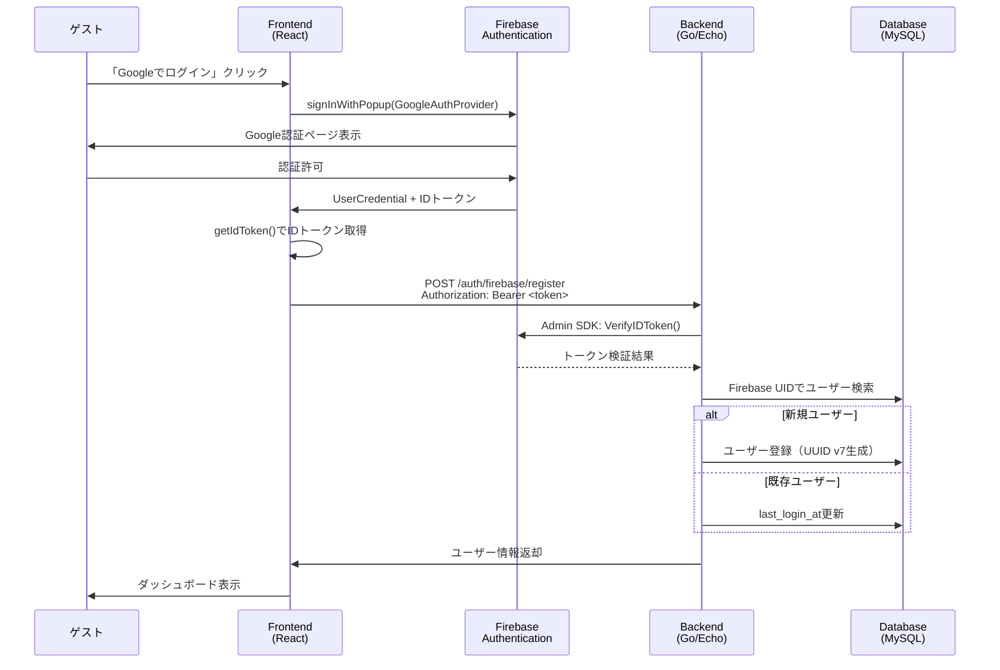
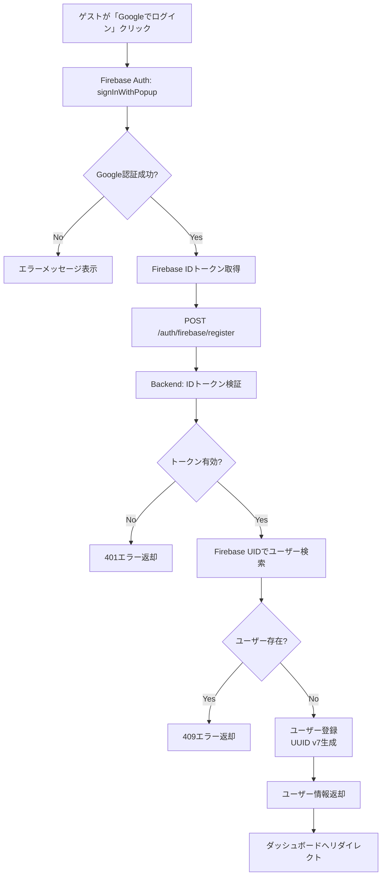
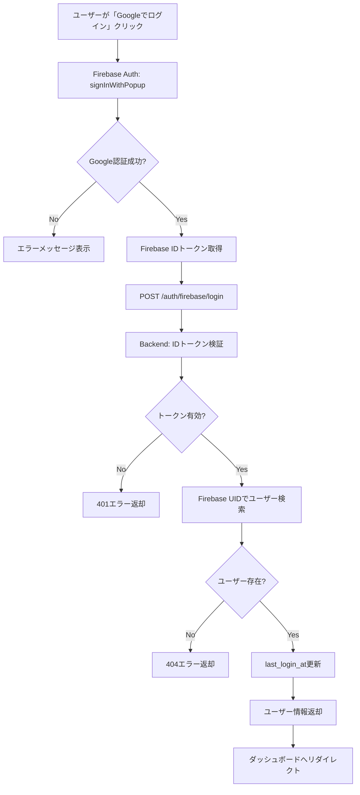
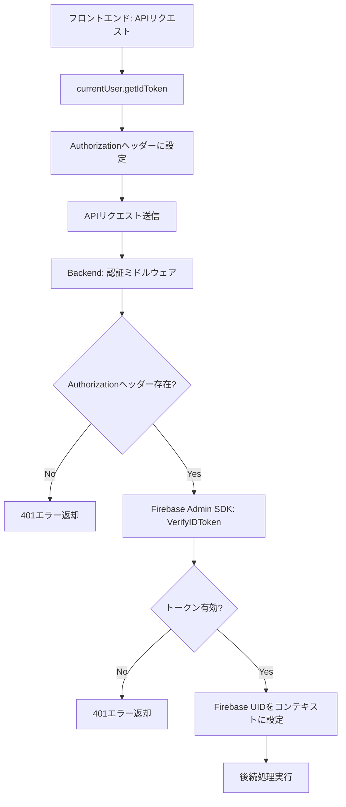

# Firebase Authentication（Google）ソーシャルログイン設計書

## 概要

本設計書は、managerサービスにおけるFirebase Authenticationを使用したGoogleソーシャルログイン機能の設計概要を記述します。Firebase Authenticationを活用することで、OAuth 2.0の複雑な実装を避け、セキュアで保守性の高い認証システムを実現します。

## 設計方針

### 基本方針

1. **Firebase Authenticationの活用**
   - OAuth 2.0の実装をFirebase SDKに委譲
   - IDトークンの検証はFirebase Admin SDKで実施
   - トークンのリフレッシュは自動化

2. **認証トークンの管理**
   - Firebase IDトークンを認証トークンとして使用
   - 独自のJWTトークンは発行しない
   - 全ての認証が必要なAPIでFirebase IDトークンを検証

3. **セキュリティ**
   - 全ての通信はHTTPSで暗号化
   - IDトークンは毎回検証
   - トークン検証失敗時は401エラー

4. **拡張性**
   - 他のソーシャルログイン（GitHub、Microsoft等）への対応が容易
   - provider_idで認証プロバイダーを識別
   - データベーススキーマの変更不要

## アーキテクチャ概要

### システム構成図



### レイヤー構成

```
┌─────────────────────────────────────┐
│   Presentation Layer                │
│   - React Components                │
│   - Firebase Auth SDK               │
│   - TanStack Router                 │
├─────────────────────────────────────┤
│   Application Layer                 │
│   - Custom Hooks                    │
│   - State Management (Jotai)        │
│   - TanStack Query                  │
├─────────────────────────────────────┤
│   API Layer                         │
│   - REST API (Echo)                 │
│   - Firebase Admin SDK              │
│   - Authentication Middleware       │
├─────────────────────────────────────┤
│   Domain Layer                      │
│   - User Aggregate                  │
│   - Value Objects                   │
│   - Repository Interfaces           │
├─────────────────────────────────────┤
│   Infrastructure Layer              │
│   - Database (MySQL + sqlc)         │
│   - Firebase Admin SDK Client       │
└─────────────────────────────────────┘
```

## 技術スタック

### バックエンド
- **言語**: Golang 1.25
- **Webフレームワーク**: Echo
- **Firebase**: Firebase Admin SDK for Go (firebase.google.com/go/v4)
- **データベース**: MySQL 8.0+
- **データベースアクセス**: sqlc
- **マイグレーション**: sqldef
- **ID生成**: google/uuid (UUID v7)
- **環境変数**: envconfig + godotenv
- **ログ**: slog (標準ライブラリ)
- **OpenAPI**: OpenAPI 3.0.3 + oapi-codegen

### フロントエンド
- **フレームワーク**: React 18+ with TypeScript
- **Firebase**: Firebase JavaScript SDK v10+ (firebase/auth)
- **UIライブラリ**: shadcn/ui
- **状態管理**: Jotai
- **ルーティング**: TanStack Router
- **HTTPクライアント**: TanStack Query
- **OpenAPI**: OpenAPI Generator

## 認証フロー

### 新規ユーザー登録フロー



### 既存ユーザーログインフロー



### 認証が必要なAPIリクエストフロー



## ドメインモデル設計

### User集約

**責務**:
- ユーザーの基本情報を管理
- Firebase認証情報を保持
- ログイン日時の更新

**主要な属性**:
- id (UserID) - UUID v7
- firebaseUID (FirebaseUID) - Firebase UID
- email (Email) - メールアドレス
- emailVerified (bool) - メール確認済みフラグ
- displayName (string) - 表示名
- photoURL (string) - プロフィール画像URL
- phoneNumber (string) - 電話番号
- providerID (string) - 認証プロバイダーID
- firebaseCreatedAt (time.Time) - Firebase作成日時
- firebaseLastSignInAt (time.Time) - Firebase最終サインイン
- lastLoginAt (time.Time) - 最終ログイン日時

**主要なメソッド**:
- NewUserWithFirebase() - Firebaseアカウントから新規ユーザー作成
- UpdateLastLogin() - 最終ログイン日時を更新
- UpdateFirebaseInfo() - Firebase情報を更新

### 値オブジェクト

#### UserID
- UUID v7を使用
- アプリケーション内部のユーザー識別子
- BINARY(16)でデータベースに保存

#### FirebaseUID
- Firebaseが発行するユーザー識別子
- 最大128文字
- ユニーク制約

#### Email
- メールアドレスの形式検証
- 最大255文字
- ユニーク制約

## ユースケース設計

### RegisterUserWithFirebaseユースケース

**目的**: Firebase認証後のユーザー登録

**入力**:
- Firebase UID
- メールアドレス
- メール確認済みフラグ
- 表示名
- プロフィール画像URL
- 電話番号
- 認証プロバイダーID
- Firebase作成日時
- Firebase最終サインイン日時

**処理**:
1. 値オブジェクトの生成
2. Firebase UIDで既存ユーザー検索
3. 既存ユーザーが存在する場合はエラー
4. 新規ユーザー作成（UUID v7生成）
5. データベースに保存

**出力**:
- ユーザーID
- Firebase UID
- メールアドレス
- 表示名

### LoginWithFirebaseユースケース

**目的**: Firebase認証後のログイン

**入力**:
- Firebase UID
- 表示名
- プロフィール画像URL
- 電話番号
- Firebase最終サインイン日時

**処理**:
1. 値オブジェクトの生成
2. Firebase UIDでユーザー検索
3. ユーザーが存在しない場合はエラー
4. Firebase情報を更新
5. 最終ログイン日時を更新
6. データベースに保存

**出力**:
- ユーザーID
- Firebase UID
- メールアドレス
- 表示名

## インフラストラクチャ設計

### Firebase Admin SDK Client

**責務**:
- Firebase Admin SDKの初期化
- IDトークンの検証
- ユーザー情報の取得

**主要なメソッド**:
- VerifyIDToken(ctx, idToken) - IDトークンを検証
- GetUser(ctx, uid) - Firebase UIDからユーザー情報を取得

### 認証ミドルウェア

**責務**:
- Authorizationヘッダーの確認
- Firebase IDトークンの検証
- Firebase UIDをコンテキストに設定

**処理フロー**:
1. Authorizationヘッダーからトークンを抽出
2. Firebase Admin SDKでトークンを検証
3. 検証成功時、Firebase UIDをコンテキストに設定
4. 検証失敗時、401エラーを返却

### リポジトリ実装

**UserCommandRepository**:
- Save(ctx, user) - ユーザーを保存
- FindByID(ctx, id) - IDでユーザーを取得
- FindByEmail(ctx, email) - メールアドレスでユーザーを取得
- FindByFirebaseUID(ctx, firebaseUID) - Firebase UIDでユーザーを取得

**実装方針**:
- sqlcで型安全なGoコードを生成
- トランザクション管理
- エラーハンドリング

## フロントエンド設計

### コンポーネント構成

**GoogleLoginButton**:
- Googleログインボタンの表示
- Firebase認証の開始
- バックエンドへのユーザー登録/ログイン
- 状態管理の更新
- ダッシュボードへのリダイレクト

**LoginPage / RegisterPage**:
- GoogleLoginButtonを配置
- レスポンシブデザイン
- エラーメッセージの表示

### カスタムHooks

**useFirebaseAuth**:
- signInWithGoogle() - Google認証を開始
- signOut() - ログアウト
- isLoading - ローディング状態
- error - エラー情報

**useRegisterWithFirebase**:
- TanStack Queryを使用
- POST /auth/firebase/register
- IDトークンをAuthorizationヘッダーに設定

**useLoginWithFirebase**:
- TanStack Queryを使用
- POST /auth/firebase/login
- IDトークンをAuthorizationヘッダーに設定

### 状態管理（Jotai）

**Atoms**:
- firebaseUserAtom - Firebase認証状態（Firebase SDKが管理）
- appUserAtom - アプリケーション固有のユーザー情報
- isAuthenticatedAtom - 認証状態（派生Atom）
- loginAtom - ログイン処理（書き込み可能Atom）
- logoutAtom - ログアウト処理（書き込み可能Atom）

### APIクライアント

**リクエストインターセプター**:
- Firebase SDKからIDトークンを取得
- Authorizationヘッダーに自動設定

**レスポンスインターセプター**:
- 401エラー時の自動ログアウト
- ログインページへのリダイレクト

## セキュリティ設計

### Firebase IDトークンの検証

**検証項目**:
- 署名の検証（Firebase公開鍵）
- 有効期限の確認
- issuerの確認（https://securetoken.google.com/<project-id>）
- audienceの確認（Firebase Project ID）

**検証タイミング**:
- 全ての認証が必要なAPIリクエスト
- 認証ミドルウェアで自動実施

### トークンのリフレッシュ

**フロントエンド**:
- Firebase SDKが自動的にリフレッシュ
- getIdToken()呼び出し時に必要に応じてリフレッシュ
- アプリケーションコードは何もする必要なし

**バックエンド**:
- 毎回トークンを検証
- 有効期限切れの場合は401エラー

### HTTPS通信

- 全ての通信はHTTPSで暗号化
- 本番環境ではHTTPSを強制
- Firebase Authenticationも自動的にHTTPSを使用

## エラーハンドリング

### エラーシナリオと対応

| シナリオ | エラーコード | HTTPステータス | ユーザーへのメッセージ |
|---------|------------|--------------|-------------------|
| Firebase認証キャンセル | - | - | Google認証がキャンセルされました |
| IDトークン無効 | INVALID_TOKEN | 401 | 認証に失敗しました |
| ユーザー既存 | USER_ALREADY_EXISTS | 409 | ユーザーが既に登録されています |
| ユーザー未登録 | USER_NOT_FOUND | 404 | ユーザーが見つかりません |
| 登録失敗 | REGISTRATION_FAILED | 500 | 登録処理中にエラーが発生しました |
| ログイン失敗 | LOGIN_FAILED | 500 | ログイン処理中にエラーが発生しました |
| 内部エラー | INTERNAL_ERROR | 500 | 内部サーバーエラーが発生しました |

### ログ出力

**構造化ログ（slog）**:
- CloudLogging形式のJSON
- Context付きログ関数を使用
- request_idを自動付与
- Firebase UIDを含める

**ログレベル**:
- INFO: 正常な処理（登録成功、ログイン成功）
- WARN: 警告（ユーザー既存、ユーザー未登録）
- ERROR: エラー（トークン検証失敗、DB エラー）

## 環境変数設定

### バックエンド

| 変数名 | 説明 | 例 |
|-------|------|-----|
| FIREBASE_PROJECT_ID | Firebase Project ID | your-project-id |
| FIREBASE_CREDENTIALS_PATH | Service Account認証情報のパス | /path/to/serviceAccountKey.json |
| DB_HOST | データベースホスト | localhost |
| DB_PORT | データベースポート | 3306 |
| DB_NAME | データベース名 | techcv_manager |
| DB_USER | データベースユーザー | root |
| DB_PASSWORD | データベースパスワード | password |
| SERVER_PORT | サーバーポート | 8080 |
| SERVER_ENV | 環境 | development |
| LOG_LEVEL | ログレベル | info |

### フロントエンド

| 変数名 | 説明 | 例 |
|-------|------|-----|
| VITE_FIREBASE_API_KEY | Firebase API Key | your-api-key |
| VITE_FIREBASE_AUTH_DOMAIN | Firebase Auth Domain | your-project.firebaseapp.com |
| VITE_FIREBASE_PROJECT_ID | Firebase Project ID | your-project-id |
| VITE_FIREBASE_STORAGE_BUCKET | Firebase Storage Bucket | your-project.appspot.com |
| VITE_FIREBASE_MESSAGING_SENDER_ID | Firebase Messaging Sender ID | your-sender-id |
| VITE_FIREBASE_APP_ID | Firebase App ID | your-app-id |
| VITE_API_BASE_URL | APIベースURL | http://localhost:8080 |

## 非機能要件

### パフォーマンス
- Firebase認証フロー全体: 30秒以内
- Firebase IDトークンの検証: 100ms以内
- ユーザー登録処理: 3秒以内
- ログイン処理: 1秒以内

### 可用性
- Firebase Authenticationの可用性に依存
- Firebaseのダウンタイムは年間0.1%未満（SLA）

### スケーラビリティ
- Firebase Authenticationは自動スケール
- バックエンドはステートレス設計
- データベースは適切なインデックス設計

## 将来の拡張

### 他のソーシャルログイン対応

**対応予定プロバイダー**:
- GitHub
- Microsoft
- Apple

**実装方針**:
- Firebase Authenticationが複数プロバイダーをサポート
- データベーススキーマは変更不要
- provider_idで識別
- 同一のフローで実装可能

### メールアドレス/パスワード認証

**将来的な追加**:
- Firebase Authenticationのメール/パスワード認証を使用
- 同一のデータベーススキーマで対応可能
- firebase_uidで統一管理

## 参考資料

- [Firebase Authentication Documentation](https://firebase.google.com/docs/auth)
- [Firebase Admin SDK for Go](https://firebase.google.com/docs/admin/setup)
- [OpenAPI 3.0.3 Specification](https://spec.openapis.org/oas/v3.0.3)
- [Clean Architecture](https://blog.cleancoder.com/uncle-bob/2012/08/13/the-clean-architecture.html)
