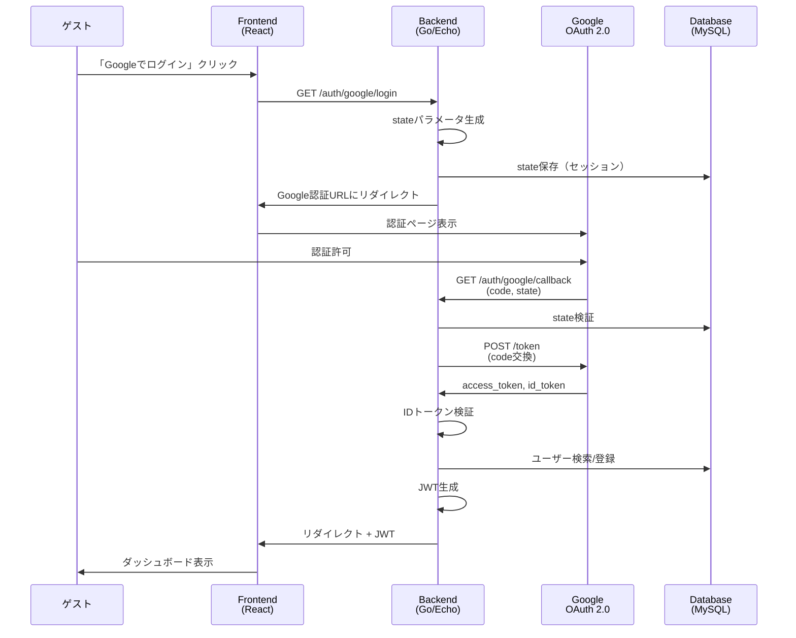

# Google ソーシャルログイン設計書

## 概要

本設計書は、managerサービスにおけるGoogleアカウントを使用したソーシャルログイン機能の詳細設計を記述します。OAuth 2.0プロトコルを使用してGoogleで認証を行い、ユーザー登録とログインを実現します。

## アーキテクチャ概要

### システム構成図



## バックエンド設計

### レイヤー構成

```
internal/
├── domain/
│   ├── model/
│   │   └── user/
│   │       ├── user.go              # User集約
│   │       ├── email.go             # Email値オブジェクト
│   │       ├── google_id.go         # GoogleID値オブジェクト
│   │       └── user_id.go           # UserID値オブジェクト
│   ├── repository/
│   │   └── user_command.go          # UserCommandRepository IF
│   └── service/
│       └── user_domain_service.go   # ドメインサービス
│
├── usecase/
│   └── user/
│       └── command/
│           ├── register_with_google.go  # Google登録ユースケース
│           └── login_with_google.go     # Googleログインユースケース
│
├── adapter/
│   └── controller/
│       └── auth/
│           └── google_oauth_controller.go  # OAuth 2.0ハンドラー
│
└── infrastructure/
    ├── persistence/
    │   ├── user_command_repository.go
    │   └── session_repository.go
    ├── oauth/
    │   └── google_oauth_client.go    # Google OAuth 2.0クライアント
    └── jwt/
        └── jwt_service.go            # JWT生成サービス
```


### Domain層の設計

#### User集約

```go
// domain/model/user/user.go
package user

import (
    "time"
)

// User集約ルート
type User struct {
    id              UserID
    email           Email
    passwordHash    *HashedPassword  // ソーシャルログインの場合はnil
    googleID        *GoogleID        // Googleログインの場合のみ設定
    name            string
    profileImage    string
    bio             string
    isActive        bool
    emailVerifiedAt *time.Time
    lastLoginAt     *time.Time
    createdAt       time.Time
    updatedAt       time.Time
}

// NewUserWithGoogle - Googleアカウントから新規ユーザーを作成
func NewUserWithGoogle(
    email Email,
    googleID GoogleID,
    name string,
    profileImage string,
) (*User, error) {
    now := time.Now().UTC()
    
    return &User{
        id:              NewUserID(),
        email:           email,
        passwordHash:    nil,  // ソーシャルログインはパスワード不要
        googleID:        &googleID,
        name:            name,
        profileImage:    profileImage,
        isActive:        true,
        emailVerifiedAt: &now,  // Googleで検証済み
        createdAt:       now,
        updatedAt:       now,
    }, nil
}

// LinkGoogleAccount - 既存ユーザーにGoogleアカウントをリンク
func (u *User) LinkGoogleAccount(googleID GoogleID) error {
    if u.googleID != nil {
        return ErrGoogleAccountAlreadyLinked
    }
    u.googleID = &googleID
    u.updatedAt = time.Now().UTC()
    return nil
}

// UpdateLastLogin - 最終ログイン日時を更新
func (u *User) UpdateLastLogin() {
    now := time.Now().UTC()
    u.lastLoginAt = &now
    u.updatedAt = now
}

// Getters
func (u *User) ID() UserID { return u.id }
func (u *User) Email() Email { return u.email }
func (u *User) GoogleID() *GoogleID { return u.googleID }
func (u *User) Name() string { return u.name }
func (u *User) ProfileImage() string { return u.profileImage }
func (u *User) IsActive() bool { return u.isActive }
func (u *User) EmailVerifiedAt() *time.Time { return u.emailVerifiedAt }
```

#### GoogleID値オブジェクト

```go
// domain/model/user/google_id.go
package user

import (
    "errors"
)

var (
    ErrInvalidGoogleID = errors.New("invalid google id")
)

// GoogleID - GoogleのユーザーID（sub）を表す値オブジェクト
type GoogleID struct {
    value string
}

// NewGoogleID - GoogleIDを生成
func NewGoogleID(value string) (GoogleID, error) {
    if value == "" {
        return GoogleID{}, ErrInvalidGoogleID
    }
    // Googleのsubは数値文字列（例: "1234567890"）
    if len(value) < 1 || len(value) > 255 {
        return GoogleID{}, ErrInvalidGoogleID
    }
    return GoogleID{value: value}, nil
}

func (g GoogleID) String() string {
    return g.value
}

func (g GoogleID) Equals(other GoogleID) bool {
    return g.value == other.value
}
```

#### リポジトリインターフェース

```go
// domain/repository/user_command.go
package repository

import (
    "context"
    "github.com/yourusername/manager/internal/domain/model/user"
)

type UserCommandRepository interface {
    // Save - ユーザーを保存（新規作成または更新）
    Save(ctx context.Context, user *user.User) error
    
    // FindByID - IDでユーザーを取得
    FindByID(ctx context.Context, id user.UserID) (*user.User, error)
    
    // FindByEmail - メールアドレスでユーザーを取得
    FindByEmail(ctx context.Context, email user.Email) (*user.User, error)
    
    // FindByGoogleID - GoogleIDでユーザーを取得
    FindByGoogleID(ctx context.Context, googleID user.GoogleID) (*user.User, error)
}
```


### UseCase層の設計

#### RegisterUserWithGoogleユースケース

```go
// usecase/user/command/register_with_google.go
package command

import (
    "context"
    "errors"
    "github.com/yourusername/manager/internal/domain/model/user"
    "github.com/yourusername/manager/internal/domain/repository"
)

var (
    ErrUserAlreadyExists = errors.New("user already exists")
)

// RegisterUserWithGoogleInput - 入力DTO
type RegisterUserWithGoogleInput struct {
    GoogleID     string
    Email        string
    Name         string
    ProfileImage string
}

// RegisterUserWithGoogleOutput - 出力DTO
type RegisterUserWithGoogleOutput struct {
    UserID string
    Email  string
    Name   string
}

// RegisterUserWithGoogleUseCase - Googleアカウントでユーザー登録
type RegisterUserWithGoogleUseCase struct {
    userRepo repository.UserCommandRepository
}

func NewRegisterUserWithGoogleUseCase(
    userRepo repository.UserCommandRepository,
) *RegisterUserWithGoogleUseCase {
    return &RegisterUserWithGoogleUseCase{
        userRepo: userRepo,
    }
}

func (uc *RegisterUserWithGoogleUseCase) Execute(
    ctx context.Context,
    input RegisterUserWithGoogleInput,
) (*RegisterUserWithGoogleOutput, error) {
    // 値オブジェクトの生成
    googleID, err := user.NewGoogleID(input.GoogleID)
    if err != nil {
        return nil, err
    }
    
    email, err := user.NewEmail(input.Email)
    if err != nil {
        return nil, err
    }
    
    // GoogleIDで既存ユーザーを検索
    existingUser, err := uc.userRepo.FindByGoogleID(ctx, googleID)
    if err == nil && existingUser != nil {
        return nil, ErrUserAlreadyExists
    }
    
    // メールアドレスで既存ユーザーを検索
    existingUserByEmail, err := uc.userRepo.FindByEmail(ctx, email)
    if err == nil && existingUserByEmail != nil {
        // 既存ユーザーにGoogleアカウントをリンク
        if err := existingUserByEmail.LinkGoogleAccount(googleID); err != nil {
            return nil, err
        }
        if err := uc.userRepo.Save(ctx, existingUserByEmail); err != nil {
            return nil, err
        }
        
        return &RegisterUserWithGoogleOutput{
            UserID: existingUserByEmail.ID().String(),
            Email:  existingUserByEmail.Email().String(),
            Name:   existingUserByEmail.Name(),
        }, nil
    }
    
    // 新規ユーザーを作成
    newUser, err := user.NewUserWithGoogle(email, googleID, input.Name, input.ProfileImage)
    if err != nil {
        return nil, err
    }
    
    // ユーザーを保存
    if err := uc.userRepo.Save(ctx, newUser); err != nil {
        return nil, err
    }
    
    return &RegisterUserWithGoogleOutput{
        UserID: newUser.ID().String(),
        Email:  newUser.Email().String(),
        Name:   newUser.Name(),
    }, nil
}
```

#### LoginWithGoogleユースケース

```go
// usecase/user/command/login_with_google.go
package command

import (
    "context"
    "errors"
    "github.com/yourusername/manager/internal/domain/model/user"
    "github.com/yourusername/manager/internal/domain/repository"
)

var (
    ErrUserNotFound = errors.New("user not found")
)

// LoginWithGoogleInput - 入力DTO
type LoginWithGoogleInput struct {
    GoogleID string
}

// LoginWithGoogleOutput - 出力DTO
type LoginWithGoogleOutput struct {
    UserID string
    Email  string
    Name   string
}

// LoginWithGoogleUseCase - Googleアカウントでログイン
type LoginWithGoogleUseCase struct {
    userRepo repository.UserCommandRepository
}

func NewLoginWithGoogleUseCase(
    userRepo repository.UserCommandRepository,
) *LoginWithGoogleUseCase {
    return &LoginWithGoogleUseCase{
        userRepo: userRepo,
    }
}

func (uc *LoginWithGoogleUseCase) Execute(
    ctx context.Context,
    input LoginWithGoogleInput,
) (*LoginWithGoogleOutput, error) {
    // 値オブジェクトの生成
    googleID, err := user.NewGoogleID(input.GoogleID)
    if err != nil {
        return nil, err
    }
    
    // GoogleIDでユーザーを検索
    existingUser, err := uc.userRepo.FindByGoogleID(ctx, googleID)
    if err != nil {
        return nil, ErrUserNotFound
    }
    
    // 最終ログイン日時を更新
    existingUser.UpdateLastLogin()
    if err := uc.userRepo.Save(ctx, existingUser); err != nil {
        return nil, err
    }
    
    return &LoginWithGoogleOutput{
        UserID: existingUser.ID().String(),
        Email:  existingUser.Email().String(),
        Name:   existingUser.Name(),
    }, nil
}
```


### Adapter層の設計

#### GoogleOAuthController

```go
// adapter/controller/auth/google_oauth_controller.go
package auth

import (
    "context"
    "net/http"
    "github.com/labstack/echo/v4"
    "github.com/yourusername/manager/internal/infrastructure/oauth"
    "github.com/yourusername/manager/internal/infrastructure/jwt"
    "github.com/yourusername/manager/internal/usecase/user/command"
)

type GoogleOAuthController struct {
    googleClient     *oauth.GoogleOAuthClient
    registerUseCase  *command.RegisterUserWithGoogleUseCase
    loginUseCase     *command.LoginWithGoogleUseCase
    jwtService       *jwt.JWTService
    sessionRepo      SessionRepository
}

func NewGoogleOAuthController(
    googleClient *oauth.GoogleOAuthClient,
    registerUseCase *command.RegisterUserWithGoogleUseCase,
    loginUseCase *command.LoginWithGoogleUseCase,
    jwtService *jwt.JWTService,
    sessionRepo SessionRepository,
) *GoogleOAuthController {
    return &GoogleOAuthController{
        googleClient:    googleClient,
        registerUseCase: registerUseCase,
        loginUseCase:    loginUseCase,
        jwtService:      jwtService,
        sessionRepo:     sessionRepo,
    }
}

// HandleGoogleLogin - Google認証フローを開始
func (c *GoogleOAuthController) HandleGoogleLogin(ctx echo.Context) error {
    // stateパラメータを生成（CSRF対策）
    state, err := generateRandomState()
    if err != nil {
        return ctx.JSON(http.StatusInternalServerError, ErrorResponse{
            RequestID: getRequestID(ctx),
            Code:      "INTERNAL_ERROR",
        })
    }
    
    // stateをセッションに保存（有効期限10分）
    if err := c.sessionRepo.SaveState(ctx.Request().Context(), state, 10*time.Minute); err != nil {
        return ctx.JSON(http.StatusInternalServerError, ErrorResponse{
            RequestID: getRequestID(ctx),
            Code:      "INTERNAL_ERROR",
        })
    }
    
    // Google認証URLを生成
    authURL := c.googleClient.GetAuthURL(state)
    
    // Google認証ページにリダイレクト
    return ctx.Redirect(http.StatusTemporaryRedirect, authURL)
}

// HandleGoogleCallback - Googleからのコールバックを処理
func (c *GoogleOAuthController) HandleGoogleCallback(ctx echo.Context) error {
    // クエリパラメータを取得
    code := ctx.QueryParam("code")
    state := ctx.QueryParam("state")
    errorParam := ctx.QueryParam("error")
    
    // エラーチェック
    if errorParam != "" {
        return ctx.Redirect(http.StatusTemporaryRedirect, 
            "/login?error=google_auth_cancelled")
    }
    
    // stateパラメータを検証
    valid, err := c.sessionRepo.ValidateState(ctx.Request().Context(), state)
    if err != nil || !valid {
        return ctx.JSON(http.StatusBadRequest, ErrorResponse{
            RequestID: getRequestID(ctx),
            Code:      "INVALID_STATE",
        })
    }
    
    // 認証コードをトークンに交換
    token, err := c.googleClient.ExchangeCode(ctx.Request().Context(), code)
    if err != nil {
        return ctx.JSON(http.StatusInternalServerError, ErrorResponse{
            RequestID: getRequestID(ctx),
            Code:      "TOKEN_EXCHANGE_FAILED",
        })
    }
    
    // IDトークンを検証してユーザー情報を取得
    userInfo, err := c.googleClient.VerifyIDToken(ctx.Request().Context(), token.IDToken)
    if err != nil {
        return ctx.JSON(http.StatusUnauthorized, ErrorResponse{
            RequestID: getRequestID(ctx),
            Code:      "INVALID_ID_TOKEN",
        })
    }
    
    // 既存ユーザーをチェック
    loginOutput, err := c.loginUseCase.Execute(ctx.Request().Context(), command.LoginWithGoogleInput{
        GoogleID: userInfo.Sub,
    })
    
    if err == command.ErrUserNotFound {
        // 新規ユーザー登録
        registerOutput, err := c.registerUseCase.Execute(ctx.Request().Context(), 
            command.RegisterUserWithGoogleInput{
                GoogleID:     userInfo.Sub,
                Email:        userInfo.Email,
                Name:         userInfo.Name,
                ProfileImage: userInfo.Picture,
            })
        if err != nil {
            return ctx.JSON(http.StatusInternalServerError, ErrorResponse{
                RequestID: getRequestID(ctx),
                Code:      "REGISTRATION_FAILED",
            })
        }
        
        // JWTトークンを生成
        jwtToken, err := c.jwtService.GenerateToken(registerOutput.UserID, registerOutput.Email)
        if err != nil {
            return ctx.JSON(http.StatusInternalServerError, ErrorResponse{
                RequestID: getRequestID(ctx),
                Code:      "TOKEN_GENERATION_FAILED",
            })
        }
        
        // ダッシュボードにリダイレクト（トークンをクエリパラメータで渡す）
        return ctx.Redirect(http.StatusTemporaryRedirect, 
            "/dashboard?token="+jwtToken+"&message=registration_success")
    }
    
    if err != nil {
        return ctx.JSON(http.StatusInternalServerError, ErrorResponse{
            RequestID: getRequestID(ctx),
            Code:      "LOGIN_FAILED",
        })
    }
    
    // JWTトークンを生成
    jwtToken, err := c.jwtService.GenerateToken(loginOutput.UserID, loginOutput.Email)
    if err != nil {
        return ctx.JSON(http.StatusInternalServerError, ErrorResponse{
            RequestID: getRequestID(ctx),
            Code:      "TOKEN_GENERATION_FAILED",
        })
    }
    
    // ダッシュボードにリダイレクト
    return ctx.Redirect(http.StatusTemporaryRedirect, 
        "/dashboard?token="+jwtToken+"&message=login_success")
}
```


### Infrastructure層の設計

#### GoogleOAuthClient

```go
// infrastructure/oauth/google_oauth_client.go
package oauth

import (
    "context"
    "encoding/json"
    "errors"
    "fmt"
    "golang.org/x/oauth2"
    "golang.org/x/oauth2/google"
    "google.golang.org/api/idtoken"
)

var (
    ErrInvalidIDToken = errors.New("invalid id token")
)

// GoogleUserInfo - Googleから取得したユーザー情報
type GoogleUserInfo struct {
    Sub     string `json:"sub"`      // GoogleユーザーID
    Email   string `json:"email"`    // メールアドレス
    Name    string `json:"name"`     // 名前
    Picture string `json:"picture"`  // プロフィール画像URL
}

// GoogleOAuthClient - Google OAuth 2.0クライアント
type GoogleOAuthClient struct {
    config *oauth2.Config
}

// NewGoogleOAuthClient - GoogleOAuthClientを生成
func NewGoogleOAuthClient(clientID, clientSecret, redirectURL string) *GoogleOAuthClient {
    config := &oauth2.Config{
        ClientID:     clientID,
        ClientSecret: clientSecret,
        RedirectURL:  redirectURL,
        Scopes: []string{
            "openid",
            "https://www.googleapis.com/auth/userinfo.email",
            "https://www.googleapis.com/auth/userinfo.profile",
        },
        Endpoint: google.Endpoint,
    }
    
    return &GoogleOAuthClient{
        config: config,
    }
}

// GetAuthURL - Google認証URLを生成
func (c *GoogleOAuthClient) GetAuthURL(state string) string {
    return c.config.AuthCodeURL(state, oauth2.AccessTypeOffline)
}

// ExchangeCode - 認証コードをトークンに交換
func (c *GoogleOAuthClient) ExchangeCode(ctx context.Context, code string) (*oauth2.Token, error) {
    token, err := c.config.Exchange(ctx, code)
    if err != nil {
        return nil, fmt.Errorf("failed to exchange code: %w", err)
    }
    return token, nil
}

// VerifyIDToken - IDトークンを検証してユーザー情報を取得
func (c *GoogleOAuthClient) VerifyIDToken(ctx context.Context, idToken string) (*GoogleUserInfo, error) {
    // IDトークンを検証
    payload, err := idtoken.Validate(ctx, idToken, c.config.ClientID)
    if err != nil {
        return nil, fmt.Errorf("failed to validate id token: %w", err)
    }
    
    // ユーザー情報を抽出
    userInfo := &GoogleUserInfo{
        Sub:     payload.Subject,
        Email:   payload.Claims["email"].(string),
        Name:    payload.Claims["name"].(string),
        Picture: payload.Claims["picture"].(string),
    }
    
    return userInfo, nil
}
```

#### JWTService

```go
// infrastructure/jwt/jwt_service.go
package jwt

import (
    "errors"
    "time"
    "github.com/golang-jwt/jwt/v5"
)

var (
    ErrInvalidToken = errors.New("invalid token")
)

// Claims - JWTクレーム
type Claims struct {
    UserID string `json:"user_id"`
    Email  string `json:"email"`
    jwt.RegisteredClaims
}

// JWTService - JWT生成・検証サービス
type JWTService struct {
    secretKey []byte
    issuer    string
}

// NewJWTService - JWTServiceを生成
func NewJWTService(secretKey, issuer string) *JWTService {
    return &JWTService{
        secretKey: []byte(secretKey),
        issuer:    issuer,
    }
}

// GenerateToken - JWTトークンを生成
func (s *JWTService) GenerateToken(userID, email string) (string, error) {
    now := time.Now()
    claims := Claims{
        UserID: userID,
        Email:  email,
        RegisteredClaims: jwt.RegisteredClaims{
            Issuer:    s.issuer,
            IssuedAt:  jwt.NewNumericDate(now),
            ExpiresAt: jwt.NewNumericDate(now.Add(24 * time.Hour)),
        },
    }
    
    token := jwt.NewWithClaims(jwt.SigningMethodHS256, claims)
    tokenString, err := token.SignedString(s.secretKey)
    if err != nil {
        return "", err
    }
    
    return tokenString, nil
}

// ValidateToken - JWTトークンを検証
func (s *JWTService) ValidateToken(tokenString string) (*Claims, error) {
    token, err := jwt.ParseWithClaims(tokenString, &Claims{}, func(token *jwt.Token) (interface{}, error) {
        return s.secretKey, nil
    })
    
    if err != nil {
        return nil, err
    }
    
    if claims, ok := token.Claims.(*Claims); ok && token.Valid {
        return claims, nil
    }
    
    return nil, ErrInvalidToken
}
```

#### SessionRepository

```go
// infrastructure/persistence/session_repository.go
package persistence

import (
    "context"
    "crypto/rand"
    "encoding/base64"
    "time"
)

// SessionRepository - セッション管理リポジトリ
type SessionRepository interface {
    SaveState(ctx context.Context, state string, ttl time.Duration) error
    ValidateState(ctx context.Context, state string) (bool, error)
    DeleteState(ctx context.Context, state string) error
}

// InMemorySessionRepository - インメモリセッションリポジトリ（開発用）
type InMemorySessionRepository struct {
    states map[string]time.Time
}

func NewInMemorySessionRepository() *InMemorySessionRepository {
    return &InMemorySessionRepository{
        states: make(map[string]time.Time),
    }
}

func (r *InMemorySessionRepository) SaveState(ctx context.Context, state string, ttl time.Duration) error {
    r.states[state] = time.Now().Add(ttl)
    return nil
}

func (r *InMemorySessionRepository) ValidateState(ctx context.Context, state string) (bool, error) {
    expiry, exists := r.states[state]
    if !exists {
        return false, nil
    }
    
    if time.Now().After(expiry) {
        delete(r.states, state)
        return false, nil
    }
    
    delete(r.states, state)  // 使用済みstateを削除
    return true, nil
}

func (r *InMemorySessionRepository) DeleteState(ctx context.Context, state string) error {
    delete(r.states, state)
    return nil
}

// generateRandomState - ランダムなstateパラメータを生成
func generateRandomState() (string, error) {
    b := make([]byte, 32)
    if _, err := rand.Read(b); err != nil {
        return "", err
    }
    return base64.URLEncoding.EncodeToString(b), nil
}
```


### データベース設計

#### スキーマ定義

```sql
-- schema/users.sql
CREATE TABLE users (
    id BINARY(16) PRIMARY KEY COMMENT 'ユーザーID（UUID v7）',
    email VARCHAR(255) NOT NULL COMMENT 'メールアドレス',
    password_hash VARCHAR(255) COMMENT 'パスワードハッシュ（ソーシャルログインの場合はNULL）',
    google_id VARCHAR(255) UNIQUE COMMENT 'GoogleユーザーID（sub）',
    name VARCHAR(100) COMMENT 'ユーザー名',
    profile_image VARCHAR(500) COMMENT 'プロフィール画像URL',
    bio TEXT COMMENT '自己紹介',
    is_active TINYINT(1) NOT NULL DEFAULT 1 COMMENT 'アクティブ状態',
    email_verified_at DATETIME(6) COMMENT 'メール確認日時',
    last_login_at DATETIME(6) COMMENT '最終ログイン日時',
    created_at DATETIME(6) NOT NULL DEFAULT CURRENT_TIMESTAMP(6) COMMENT '作成日時',
    updated_at DATETIME(6) NOT NULL DEFAULT CURRENT_TIMESTAMP(6) ON UPDATE CURRENT_TIMESTAMP(6) COMMENT '更新日時',
    deleted_at DATETIME(6) COMMENT '削除日時',
    
    UNIQUE KEY uq_users_email (email),
    UNIQUE KEY uq_users_google_id (google_id),
    INDEX idx_users_deleted_at (deleted_at),
    INDEX idx_users_created_at (created_at)
) ENGINE=InnoDB DEFAULT CHARSET=utf8mb4 COLLATE=utf8mb4_unicode_ci COMMENT='ユーザー情報';
```

#### sqlcクエリ定義

```sql
-- query/user_command.sql

-- name: CreateUserWithGoogle :execresult
INSERT INTO users (
    id,
    email,
    google_id,
    name,
    profile_image,
    email_verified_at,
    is_active,
    created_at,
    updated_at
) VALUES (
    sqlc.arg('id'),
    sqlc.arg('email'),
    sqlc.arg('google_id'),
    sqlc.arg('name'),
    sqlc.arg('profile_image'),
    sqlc.arg('email_verified_at'),
    sqlc.arg('is_active'),
    sqlc.arg('created_at'),
    sqlc.arg('updated_at')
);

-- name: GetUserByGoogleID :one
SELECT 
    id,
    email,
    password_hash,
    google_id,
    name,
    profile_image,
    bio,
    is_active,
    email_verified_at,
    last_login_at,
    created_at,
    updated_at,
    deleted_at
FROM users
WHERE google_id = sqlc.arg('google_id') AND deleted_at IS NULL;

-- name: UpdateUserGoogleID :exec
UPDATE users
SET
    google_id = sqlc.arg('google_id'),
    updated_at = sqlc.arg('updated_at')
WHERE id = sqlc.arg('id') AND deleted_at IS NULL;

-- name: UpdateUserLastLogin :exec
UPDATE users
SET
    last_login_at = sqlc.arg('last_login_at'),
    updated_at = sqlc.arg('updated_at')
WHERE id = sqlc.arg('id') AND deleted_at IS NULL;
```

#### リポジトリ実装

```go
// infrastructure/persistence/user_command_repository.go
package persistence

import (
    "context"
    "database/sql"
    "fmt"
    "github.com/yourusername/manager/internal/domain/model/user"
    "github.com/yourusername/manager/internal/infrastructure/persistence/sqlc"
)

type userCommandRepository struct {
    db *sql.DB
}

func NewUserCommandRepository(db *sql.DB) *userCommandRepository {
    return &userCommandRepository{db: db}
}

func (r *userCommandRepository) Save(ctx context.Context, u *user.User) error {
    queries := sqlc.New(r.db)
    
    // 既存ユーザーをチェック
    existing, err := queries.GetUserByID(ctx, u.ID().Bytes())
    if err != nil && err != sql.ErrNoRows {
        return fmt.Errorf("failed to check existing user: %w", err)
    }
    
    if existing.ID != nil {
        // 更新
        return r.update(ctx, queries, u)
    }
    
    // 新規作成
    return r.create(ctx, queries, u)
}

func (r *userCommandRepository) create(ctx context.Context, queries *sqlc.Queries, u *user.User) error {
    var googleID sql.NullString
    if u.GoogleID() != nil {
        googleID = sql.NullString{String: u.GoogleID().String(), Valid: true}
    }
    
    var emailVerifiedAt sql.NullTime
    if u.EmailVerifiedAt() != nil {
        emailVerifiedAt = sql.NullTime{Time: *u.EmailVerifiedAt(), Valid: true}
    }
    
    _, err := queries.CreateUserWithGoogle(ctx, sqlc.CreateUserWithGoogleParams{
        ID:              u.ID().Bytes(),
        Email:           u.Email().String(),
        GoogleID:        googleID,
        Name:            u.Name(),
        ProfileImage:    u.ProfileImage(),
        EmailVerifiedAt: emailVerifiedAt,
        IsActive:        boolToTinyInt(u.IsActive()),
        CreatedAt:       u.CreatedAt(),
        UpdatedAt:       u.UpdatedAt(),
    })
    
    if err != nil {
        return fmt.Errorf("failed to create user: %w", err)
    }
    
    return nil
}

func (r *userCommandRepository) FindByGoogleID(ctx context.Context, googleID user.GoogleID) (*user.User, error) {
    queries := sqlc.New(r.db)
    
    row, err := queries.GetUserByGoogleID(ctx, sql.NullString{
        String: googleID.String(),
        Valid:  true,
    })
    if err == sql.ErrNoRows {
        return nil, nil
    }
    if err != nil {
        return nil, fmt.Errorf("failed to get user by google id: %w", err)
    }
    
    return r.toUserModel(row)
}

func (r *userCommandRepository) toUserModel(row sqlc.User) (*user.User, error) {
    // sqlcの結果からドメインモデルに変換
    // 実装の詳細は省略
    return nil, nil
}

func boolToTinyInt(b bool) int8 {
    if b {
        return 1
    }
    return 0
}
```


## フロントエンド設計

### コンポーネント構成

```
src/
├── pages/
│   ├── auth/
│   │   ├── LoginPage.tsx              # ログインページ
│   │   ├── RegisterPage.tsx           # 登録ページ
│   │   └── GoogleCallbackPage.tsx     # Googleコールバックページ
│   └── DashboardPage.tsx
│
├── components/
│   └── features/
│       └── auth/
│           ├── GoogleLoginButton.tsx  # Googleログインボタン
│           └── AuthCallback.tsx       # 認証コールバック処理
│
├── hooks/
│   └── api/
│       └── useGoogleAuth.ts           # Google認証Hook
│
├── stores/
│   └── authStore.ts                   # 認証状態管理
│
└── api/
    └── endpoints/
        └── authApi.ts                 # 認証API
```

### Presentation層

#### GoogleLoginButton

```typescript
// components/features/auth/GoogleLoginButton.tsx
import { Button } from '@/components/ui/button';
import { useGoogleLogin } from '@/hooks/api/useGoogleAuth';

export const GoogleLoginButton = () => {
  const { initiateLogin, isLoading } = useGoogleLogin();

  const handleClick = () => {
    initiateLogin();
  };

  return (
    <Button
      onClick={handleClick}
      disabled={isLoading}
      variant="outline"
      className="w-full"
    >
      <svg className="mr-2 h-4 w-4" viewBox="0 0 24 24">
        {/* Google icon SVG */}
      </svg>
      Googleでログイン
    </Button>
  );
};
```

#### LoginPage

```typescript
// pages/auth/LoginPage.tsx
import { GoogleLoginButton } from '@/components/features/auth/GoogleLoginButton';
import { Card, CardContent, CardHeader, CardTitle } from '@/components/ui/card';

export const LoginPage = () => {
  return (
    <div className="flex min-h-screen items-center justify-center">
      <Card className="w-full max-w-md">
        <CardHeader>
          <CardTitle>ログイン</CardTitle>
        </CardHeader>
        <CardContent className="space-y-4">
          <GoogleLoginButton />
          
          <div className="relative">
            <div className="absolute inset-0 flex items-center">
              <span className="w-full border-t" />
            </div>
            <div className="relative flex justify-center text-xs uppercase">
              <span className="bg-background px-2 text-muted-foreground">
                または
              </span>
            </div>
          </div>
          
          {/* メールアドレス/パスワードログインフォーム */}
        </CardContent>
      </Card>
    </div>
  );
};
```

#### GoogleCallbackPage

```typescript
// pages/auth/GoogleCallbackPage.tsx
import { useEffect } from 'react';
import { useNavigate, useSearch } from '@tanstack/react-router';
import { useAuthCallback } from '@/hooks/api/useGoogleAuth';
import { LoadingSpinner } from '@/components/ui/loading-spinner';

export const GoogleCallbackPage = () => {
  const navigate = useNavigate();
  const search = useSearch({ from: '/auth/google/callback' });
  const { handleCallback, isLoading, error } = useAuthCallback();

  useEffect(() => {
    const processCallback = async () => {
      const token = search.token;
      const message = search.message;
      
      if (token) {
        // トークンを保存
        localStorage.setItem('auth_token', token);
        
        // ダッシュボードにリダイレクト
        navigate({ to: '/dashboard' });
        
        // 成功メッセージを表示
        if (message === 'registration_success') {
          toast.success('登録が完了しました');
        } else if (message === 'login_success') {
          toast.success('ログインしました');
        }
      } else if (search.error) {
        // エラー処理
        toast.error('認証に失敗しました');
        navigate({ to: '/login' });
      }
    };
    
    processCallback();
  }, [search, navigate]);

  if (isLoading) {
    return (
      <div className="flex min-h-screen items-center justify-center">
        <LoadingSpinner />
      </div>
    );
  }

  if (error) {
    return (
      <div className="flex min-h-screen items-center justify-center">
        <p className="text-red-500">認証に失敗しました</p>
      </div>
    );
  }

  return null;
};
```

### Application層

#### useGoogleAuth Hook

```typescript
// hooks/api/useGoogleAuth.ts
import { useState } from 'react';
import { authApi } from '@/api/endpoints/authApi';

export const useGoogleLogin = () => {
  const [isLoading, setIsLoading] = useState(false);

  const initiateLogin = async () => {
    setIsLoading(true);
    try {
      // バックエンドのGoogle認証エンドポイントにリダイレクト
      window.location.href = `${import.meta.env.VITE_API_BASE_URL}/techcv/api/v1/auth/google/login`;
    } catch (error) {
      console.error('Failed to initiate Google login:', error);
      setIsLoading(false);
    }
  };

  return { initiateLogin, isLoading };
};

export const useAuthCallback = () => {
  const [isLoading, setIsLoading] = useState(false);
  const [error, setError] = useState<Error | null>(null);

  const handleCallback = async (token: string) => {
    setIsLoading(true);
    setError(null);
    
    try {
      // トークンを検証（オプション）
      // const user = await authApi.verifyToken(token);
      
      // 認証状態を更新
      localStorage.setItem('auth_token', token);
      
      return true;
    } catch (err) {
      setError(err as Error);
      return false;
    } finally {
      setIsLoading(false);
    }
  };

  return { handleCallback, isLoading, error };
};
```

### Infrastructure層

#### authApi

```typescript
// api/endpoints/authApi.ts
import { apiClient } from '@/api/client';

export const authApi = {
  // Google認証を開始（実際にはリダイレクトするだけ）
  initiateGoogleLogin: () => {
    window.location.href = `${import.meta.env.VITE_API_BASE_URL}/techcv/api/v1/auth/google/login`;
  },
  
  // トークンを検証
  verifyToken: async (token: string) => {
    return apiClient.get('auth/verify', {
      headers: {
        Authorization: `Bearer ${token}`,
      },
    }).json();
  },
};
```

### 状態管理

#### authStore

```typescript
// stores/authStore.ts
import { atom } from 'jotai';
import { atomWithStorage } from 'jotai/utils';

export type User = {
  id: string;
  email: string;
  name: string;
  profileImage?: string;
};

// トークンをローカルストレージに保存
export const authTokenAtom = atomWithStorage<string | null>('auth_token', null);

// ユーザー情報
export const userAtom = atom<User | null>(null);

// 認証状態
export const isAuthenticatedAtom = atom((get) => {
  const token = get(authTokenAtom);
  const user = get(userAtom);
  return token !== null && user !== null;
});

// ログイン処理
export const loginAtom = atom(
  null,
  (get, set, { token, user }: { token: string; user: User }) => {
    set(authTokenAtom, token);
    set(userAtom, user);
  }
);

// ログアウト処理
export const logoutAtom = atom(null, (get, set) => {
  set(authTokenAtom, null);
  set(userAtom, null);
});
```


## API設計

### OpenAPI定義

```yaml
# spec/paths/auth.yaml
/auth/google/login:
  get:
    summary: Google認証フローを開始
    description: |
      Google OAuth 2.0認証フローを開始します。
      stateパラメータを生成してセッションに保存し、Googleの認証ページにリダイレクトします。
    tags:
      - Authentication
    responses:
      '307':
        description: Googleの認証ページにリダイレクト
      '500':
        description: 内部サーバーエラー
        content:
          application/json:
            schema:
              $ref: '#/components/schemas/ErrorResponse'

/auth/google/callback:
  get:
    summary: Googleからのコールバックを処理
    description: |
      Google OAuth 2.0認証フローのコールバックを処理します。
      認証コードをトークンに交換し、ユーザー情報を取得して登録またはログインを行います。
    tags:
      - Authentication
    parameters:
      - name: code
        in: query
        required: true
        schema:
          type: string
        description: Google認証コード
      - name: state
        in: query
        required: true
        schema:
          type: string
        description: CSRF対策用のstateパラメータ
      - name: error
        in: query
        required: false
        schema:
          type: string
        description: 認証エラー
    responses:
      '307':
        description: ダッシュボードにリダイレクト
      '400':
        description: 不正なリクエスト
        content:
          application/json:
            schema:
              $ref: '#/components/schemas/ErrorResponse'
      '401':
        description: 認証失敗
        content:
          application/json:
            schema:
              $ref: '#/components/schemas/ErrorResponse'
      '500':
        description: 内部サーバーエラー
        content:
          application/json:
            schema:
              $ref: '#/components/schemas/ErrorResponse'
```

### エラーコード定義

```yaml
# spec/components/schemas.yaml
ErrorResponse:
  type: object
  required:
    - requestId
  properties:
    requestId:
      type: string
      description: リクエストID
      example: "88374925"
    code:
      type: string
      description: エラーコード
      enum:
        - INTERNAL_ERROR
        - INVALID_STATE
        - TOKEN_EXCHANGE_FAILED
        - INVALID_ID_TOKEN
        - REGISTRATION_FAILED
        - LOGIN_FAILED
        - TOKEN_GENERATION_FAILED
      example: "INVALID_STATE"
    details:
      type: array
      description: 詳細エラー情報
      items:
        type: object
        properties:
          field:
            type: string
          code:
            type: string
```

## セキュリティ設計

### CSRF対策

1. **stateパラメータの使用**
   - ランダムな32バイトの値を生成
   - Base64エンコードして使用
   - セッションまたはクッキーに保存（有効期限10分）
   - コールバック時に検証し、一致しない場合はエラー

2. **stateの管理方法**
   - 開発環境: インメモリストア
   - 本番環境: Redis等の外部ストア推奨

### IDトークン検証

1. **署名の検証**
   - GoogleのJWKS（JSON Web Key Set）を使用
   - `google.golang.org/api/idtoken`パッケージで自動検証

2. **クレームの検証**
   - `iss`: `https://accounts.google.com` または `accounts.google.com`
   - `aud`: アプリケーションのClient ID
   - `exp`: 有効期限が切れていないこと
   - `iat`: 発行日時が妥当であること

### トークン管理

1. **JWTトークン**
   - HS256アルゴリズムで署名
   - 有効期限: 24時間
   - クレーム: user_id, email, iat, exp

2. **トークンの保存**
   - フロントエンド: localStorage（XSS対策が必要）
   - または: HttpOnly Cookie（CSRF対策が必要）

### HTTPS通信

- すべての通信はHTTPSで暗号化
- 本番環境ではHTTPSを強制
- リダイレクトURIもHTTPSを使用

## エラーハンドリング

### エラーシナリオと対応

| シナリオ | エラーコード | HTTPステータス | ユーザーへのメッセージ |
|---------|------------|--------------|-------------------|
| stateパラメータ不一致 | INVALID_STATE | 400 | 認証に失敗しました。再度お試しください |
| トークン交換失敗 | TOKEN_EXCHANGE_FAILED | 500 | 認証に失敗しました。再度お試しください |
| IDトークン検証失敗 | INVALID_ID_TOKEN | 401 | 認証に失敗しました。再度お試しください |
| ユーザー登録失敗 | REGISTRATION_FAILED | 500 | 登録処理中にエラーが発生しました |
| ログイン失敗 | LOGIN_FAILED | 500 | ログイン処理中にエラーが発生しました |
| JWT生成失敗 | TOKEN_GENERATION_FAILED | 500 | 認証トークンの生成に失敗しました |
| Google認証キャンセル | - | 307 | Google認証がキャンセルされました |
| ネットワークエラー | INTERNAL_ERROR | 500 | ネットワークエラーが発生しました |

### ログ出力

```go
// エラーログの例
{
  "severity": "ERROR",
  "request_id": "88374925",
  "user_id": "01234567-89ab-cdef-0123-456789abcdef",
  "message": "Failed to exchange authorization code",
  "error": "oauth2: cannot fetch token: 400 Bad Request",
  "timestamp": "2024-01-15T12:34:56.789Z"
}

// 情報ログの例
{
  "severity": "INFO",
  "request_id": "88374925",
  "user_id": "01234567-89ab-cdef-0123-456789abcdef",
  "message": "User registered with Google",
  "google_id": "1234567890",
  "email": "user@example.com",
  "timestamp": "2024-01-15T12:34:56.789Z"
}
```


## 環境変数設定

### バックエンド環境変数

```bash
# .env.example

# Google OAuth 2.0設定
GOOGLE_CLIENT_ID=your-client-id.apps.googleusercontent.com
GOOGLE_CLIENT_SECRET=your-client-secret
GOOGLE_REDIRECT_URL=http://localhost:8080/techcv/api/v1/auth/google/callback

# JWT設定
JWT_SECRET_KEY=your-secret-key-change-in-production
JWT_ISSUER=techcv-manager

# セッション設定（本番環境ではRedis等を使用）
SESSION_STORE_TYPE=memory  # memory | redis
REDIS_URL=redis://localhost:6379

# データベース設定
DB_HOST=localhost
DB_PORT=3306
DB_NAME=techcv_manager
DB_USER=root
DB_PASSWORD=password

# アプリケーション設定
APP_ENV=development  # development | production
APP_URL=http://localhost:3000
API_BASE_URL=http://localhost:8080
```

### フロントエンド環境変数

```bash
# .env.example

# API設定
VITE_API_BASE_URL=http://localhost:8080

# アプリケーション設定
VITE_APP_URL=http://localhost:3000
```

## テスト戦略

### 単体テスト

#### Domain層のテスト

```go
// domain/model/user/user_test.go
func TestNewUserWithGoogle(t *testing.T) {
    tests := []struct {
        name         string
        email        string
        googleID     string
        userName     string
        profileImage string
        wantErr      bool
    }{
        {
            name:         "正常なユーザー作成",
            email:        "test@example.com",
            googleID:     "1234567890",
            userName:     "Test User",
            profileImage: "https://example.com/image.jpg",
            wantErr:      false,
        },
        {
            name:         "不正なメールアドレス",
            email:        "invalid-email",
            googleID:     "1234567890",
            userName:     "Test User",
            profileImage: "",
            wantErr:      true,
        },
    }
    
    for _, tt := range tests {
        t.Run(tt.name, func(t *testing.T) {
            email, _ := user.NewEmail(tt.email)
            googleID, _ := user.NewGoogleID(tt.googleID)
            
            u, err := user.NewUserWithGoogle(email, googleID, tt.userName, tt.profileImage)
            
            if tt.wantErr {
                assert.Error(t, err)
                assert.Nil(t, u)
            } else {
                assert.NoError(t, err)
                assert.NotNil(t, u)
                assert.Equal(t, tt.email, u.Email().String())
                assert.Equal(t, tt.googleID, u.GoogleID().String())
                assert.NotNil(t, u.EmailVerifiedAt())
            }
        })
    }
}
```

#### UseCase層のテスト

```go
// usecase/user/command/register_with_google_test.go
func TestRegisterUserWithGoogleUseCase_Execute(t *testing.T) {
    // モックリポジトリを使用
    mockRepo := &MockUserCommandRepository{}
    useCase := NewRegisterUserWithGoogleUseCase(mockRepo)
    
    tests := []struct {
        name    string
        input   RegisterUserWithGoogleInput
        setup   func()
        wantErr bool
    }{
        {
            name: "新規ユーザー登録成功",
            input: RegisterUserWithGoogleInput{
                GoogleID:     "1234567890",
                Email:        "test@example.com",
                Name:         "Test User",
                ProfileImage: "https://example.com/image.jpg",
            },
            setup: func() {
                mockRepo.On("FindByGoogleID", mock.Anything, mock.Anything).Return(nil, nil)
                mockRepo.On("FindByEmail", mock.Anything, mock.Anything).Return(nil, nil)
                mockRepo.On("Save", mock.Anything, mock.Anything).Return(nil)
            },
            wantErr: false,
        },
        {
            name: "既存ユーザーにGoogleアカウントをリンク",
            input: RegisterUserWithGoogleInput{
                GoogleID:     "1234567890",
                Email:        "existing@example.com",
                Name:         "Existing User",
                ProfileImage: "",
            },
            setup: func() {
                existingUser := createTestUser()
                mockRepo.On("FindByGoogleID", mock.Anything, mock.Anything).Return(nil, nil)
                mockRepo.On("FindByEmail", mock.Anything, mock.Anything).Return(existingUser, nil)
                mockRepo.On("Save", mock.Anything, mock.Anything).Return(nil)
            },
            wantErr: false,
        },
    }
    
    for _, tt := range tests {
        t.Run(tt.name, func(t *testing.T) {
            tt.setup()
            
            output, err := useCase.Execute(context.Background(), tt.input)
            
            if tt.wantErr {
                assert.Error(t, err)
                assert.Nil(t, output)
            } else {
                assert.NoError(t, err)
                assert.NotNil(t, output)
            }
        })
    }
}
```

### 統合テスト

#### APIエンドポイントのテスト

```go
// adapter/controller/auth/google_oauth_controller_test.go
func TestGoogleOAuthController_HandleGoogleLogin(t *testing.T) {
    // テスト用のEchoインスタンスを作成
    e := echo.New()
    req := httptest.NewRequest(http.MethodGet, "/auth/google/login", nil)
    rec := httptest.NewRecorder()
    c := e.NewContext(req, rec)
    
    // コントローラーを作成
    controller := setupTestController()
    
    // テスト実行
    err := controller.HandleGoogleLogin(c)
    
    // 検証
    assert.NoError(t, err)
    assert.Equal(t, http.StatusTemporaryRedirect, rec.Code)
    assert.Contains(t, rec.Header().Get("Location"), "accounts.google.com")
}

func TestGoogleOAuthController_HandleGoogleCallback(t *testing.T) {
    tests := []struct {
        name           string
        queryParams    map[string]string
        mockSetup      func(*MockGoogleClient, *MockUseCase)
        expectedStatus int
        expectedRedirect string
    }{
        {
            name: "新規ユーザー登録成功",
            queryParams: map[string]string{
                "code":  "test-code",
                "state": "valid-state",
            },
            mockSetup: func(client *MockGoogleClient, uc *MockUseCase) {
                client.On("ExchangeCode", mock.Anything, "test-code").Return(&oauth2.Token{}, nil)
                client.On("VerifyIDToken", mock.Anything, mock.Anything).Return(&GoogleUserInfo{
                    Sub:   "1234567890",
                    Email: "test@example.com",
                    Name:  "Test User",
                }, nil)
                uc.On("Execute", mock.Anything, mock.Anything).Return(&RegisterUserWithGoogleOutput{
                    UserID: "user-id",
                    Email:  "test@example.com",
                }, nil)
            },
            expectedStatus: http.StatusTemporaryRedirect,
            expectedRedirect: "/dashboard",
        },
    }
    
    for _, tt := range tests {
        t.Run(tt.name, func(t *testing.T) {
            // テスト実行
            // ...
        })
    }
}
```

### E2Eテスト（フロントエンド）

```typescript
// e2e/google-login.spec.ts
import { test, expect } from '@playwright/test';

test.describe('Google Login', () => {
  test('should display Google login button', async ({ page }) => {
    await page.goto('/login');
    
    const googleButton = page.getByRole('button', { name: /Googleでログイン/i });
    await expect(googleButton).toBeVisible();
  });
  
  test('should redirect to Google auth page when clicking button', async ({ page }) => {
    await page.goto('/login');
    
    const googleButton = page.getByRole('button', { name: /Googleでログイン/i });
    await googleButton.click();
    
    // Google認証ページにリダイレクトされることを確認
    await expect(page).toHaveURL(/accounts\.google\.com/);
  });
  
  // Note: 実際のGoogle認証フローのテストはモックを使用
  test('should handle successful authentication', async ({ page, context }) => {
    // モックのコールバックURLを設定
    await page.goto('/auth/google/callback?token=mock-jwt-token&message=registration_success');
    
    // ダッシュボードにリダイレクトされることを確認
    await expect(page).toHaveURL('/dashboard');
    
    // 成功メッセージが表示されることを確認
    await expect(page.getByText('登録が完了しました')).toBeVisible();
  });
});
```

## デプロイメント

### Google Cloud Console設定

1. **OAuth 2.0クライアントIDの作成**
   - Google Cloud Consoleにアクセス
   - プロジェクトを選択または作成
   - 「APIとサービス」→「認証情報」
   - 「認証情報を作成」→「OAuth 2.0クライアントID」
   - アプリケーションの種類: Webアプリケーション
   - 承認済みのリダイレクトURIを追加:
     - 開発: `http://localhost:8080/techcv/api/v1/auth/google/callback`
     - 本番: `https://api.yourdomain.com/techcv/api/v1/auth/google/callback`

2. **OAuth同意画面の設定**
   - ユーザータイプ: 外部
   - アプリ名、サポートメール、デベロッパーの連絡先情報を入力
   - スコープを追加: `openid`, `email`, `profile`

### 本番環境の考慮事項

1. **セッション管理**
   - Redisを使用してstateパラメータを管理
   - 複数サーバー間でセッションを共有

2. **HTTPS強制**
   - すべてのエンドポイントでHTTPSを強制
   - HSTSヘッダーを設定

3. **レート制限**
   - 認証エンドポイントにレート制限を設定
   - 同一IPからの過度なリクエストを制限

4. **監視とアラート**
   - 認証失敗率を監視
   - Google APIのエラー率を監視
   - 異常なトラフィックを検知

## パフォーマンス最適化

### キャッシュ戦略

1. **GoogleのJWKSキャッシュ**
   - IDトークン検証用の公開鍵をキャッシュ
   - TTL: 24時間

2. **ユーザー情報キャッシュ**
   - 頻繁にアクセスされるユーザー情報をキャッシュ
   - Redis等を使用

### データベース最適化

1. **インデックス**
   - `google_id`にユニークインデックス
   - `email`にユニークインデックス
   - 検索パフォーマンスを向上

2. **コネクションプール**
   - 適切なコネクションプール設定
   - 最大接続数、アイドルタイムアウト等

## 今後の拡張

### 他のソーシャルログインの追加

設計を拡張可能にするため、以下の構造を採用:

```go
// domain/model/user/social_provider.go
type SocialProvider string

const (
    SocialProviderGoogle   SocialProvider = "google"
    SocialProviderGitHub   SocialProvider = "github"
    SocialProviderMicrosoft SocialProvider = "microsoft"
)

type SocialAccount struct {
    provider SocialProvider
    providerUserID string
}
```

データベーススキーマも拡張:

```sql
CREATE TABLE user_social_accounts (
    id BINARY(16) PRIMARY KEY,
    user_id BINARY(16) NOT NULL,
    provider VARCHAR(50) NOT NULL,
    provider_user_id VARCHAR(255) NOT NULL,
    created_at DATETIME(6) NOT NULL,
    
    FOREIGN KEY (user_id) REFERENCES users(id),
    UNIQUE KEY uq_provider_user (provider, provider_user_id)
);
```

## まとめ

本設計書では、Googleソーシャルログイン機能の詳細な設計を記述しました。

### 主要な設計ポイント

1. **Clean Architecture + DDD + CQRS**
   - レイヤー分離による保守性の向上
   - ドメインモデルによるビジネスロジックの集約
   - コマンド側での集約の使用

2. **セキュリティ**
   - CSRF対策（stateパラメータ）
   - IDトークン検証
   - HTTPS通信の強制

3. **拡張性**
   - 他のソーシャルログインへの対応が容易
   - メールアドレス/パスワード認証との併用

4. **パフォーマンス**
   - 適切なインデックス設計
   - キャッシュ戦略
   - コネクションプール

5. **テスタビリティ**
   - 各レイヤーの独立したテスト
   - モックを使用した単体テスト
   - E2Eテストによる統合検証
