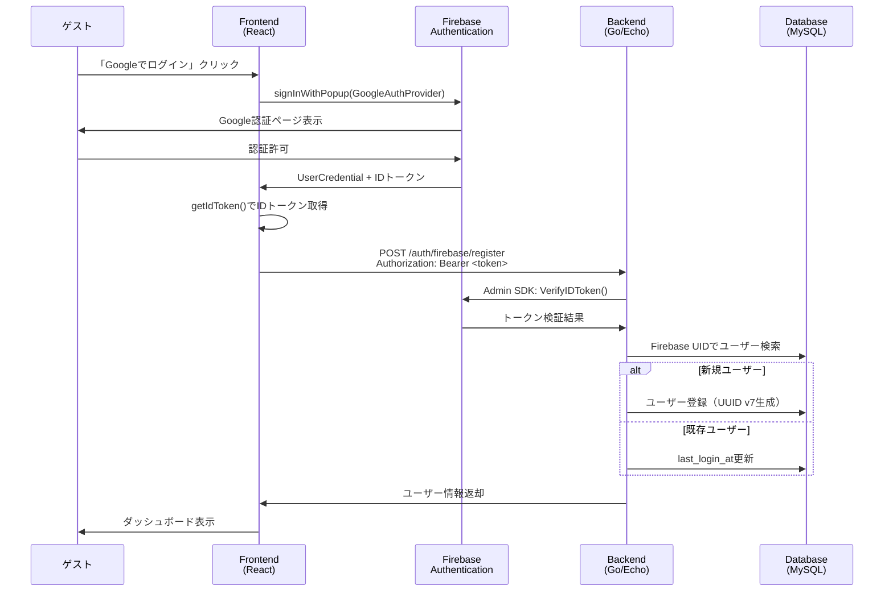

# Firebase Authentication（Google）ソーシャルログイン設計書

## 概要

本設計書は、managerサービスにおけるFirebase Authenticationを使用したGoogleソーシャルログイン機能の詳細設計を記述します。Firebase Authenticationを活用することで、OAuth 2.0の複雑な実装を避け、セキュアで保守性の高い認証システムを実現します。

## アーキテクチャ概要

### システム構成図


```mermaid
sequenceDiagram
    participant User as ゲスト
    participant Frontend as Frontend<br/>(React)
    participant Firebase as Firebase<br/>Authentication
    participant Backend as Backend<br/>(Go/Echo)
    participant DB as Database<br/>(MySQL)

    User->>Frontend: 「Googleでログイン」クリック
    Frontend->>Firebase: signInWithPopup(GoogleAuthProvider)
    Firebase->>User: Google認証ページ表示
    User->>Firebase: 認証許可
    Firebase->>Frontend: UserCredential + IDトークン
    Frontend->>Frontend: getIdToken()でIDトークン取得
    Frontend->>Backend: POST /auth/firebase/register<br/>Authorization: Bearer <token>
    Backend->>Firebase: Admin SDK: VerifyIDToken()
    Firebase->>Backend: トークン検証結果
    Backend->>DB: Firebase UIDでユーザー検索
    alt 新規ユーザー
        Backend->>DB: ユーザー登録（UUID v7生成）
    else 既存ユーザー
        Backend->>DB: last_login_at更新
    end
    Backend->>Frontend: ユーザー情報返却
    Frontend->>User: ダッシュボード表示
```

## 技術スタック

### バックエンド
- **言語**: Golang 1.25
- **Webフレームワーク**: Echo
- **Firebase**: Firebase Admin SDK for Go (firebase.google.com/go/v4)
- **データベース**: MySQL 8.0+
- **データベースアクセス**: sqlc
- **マイグレーション**: sqldef
- **ID生成**: google/uuid (UUID v7)
- **環境変数**: envconfig + godotenv
- **ログ**: slog (標準ライブラリ)
- **OpenAPI**: OpenAPI 3.0.3 + oapi-codegen

### フロントエンド
- **フレームワーク**: React 18+ with TypeScript
- **Firebase**: Firebase JavaScript SDK v10+ (firebase/auth)
- **UIライブラリ**: shadcn/ui
- **状態管理**: Jotai
- **ルーティング**: TanStack Router
- **HTTPクライアント**: TanStack Query
- **OpenAPI**: OpenAPI Generator

## バックエンド設計

### ディレクトリ構造

```
services/manager/backend/
├── internal/
│   ├── domain/
│   │   ├── model/
│   │   │   └── user/
│   │   │       ├── user.go              # User集約
│   │   │       ├── email.go             # Email値オブジェクト
│   │   │       ├── firebase_uid.go      # FirebaseUID値オブジェクト
│   │   │       └── user_id.go           # UserID値オブジェクト
│   │   ├── repository/
│   │   │   └── user_command.go          # UserCommandRepository IF
│   │   └── service/
│   │       └── user_domain_service.go   # ドメインサービス
│   │
│   ├── usecase/
│   │   └── user/
│   │       └── command/
│   │           ├── register_with_firebase.go  # Firebase登録ユースケース
│   │           └── login_with_firebase.go     # Firebaseログインユースケース
│   │
│   ├── adapter/
│   │   └── controller/
│   │       └── auth/
│   │           └── firebase_auth_controller.go  # Firebase認証ハンドラー
│   │
│   └── infrastructure/
│       ├── persistence/
│       │   ├── sqlc/                    # sqlc生成コード
│       │   ├── query/                   # SQLクエリファイル
│       │   ├── schema/                  # スキーマ定義
│       │   └── user_command_repository.go
│       ├── firebase/
│       │   └── firebase_client.go       # Firebase Admin SDK
│       └── middleware/
│           └── firebase_auth_middleware.go  # 認証ミドルウェア
│
├── cmd/
│   └── server/
│       └── main.go
│
└── sqlc.yaml                            # sqlc設定
```


### Domain層の設計

#### User集約

```go
// domain/model/user/user.go
package user

import (
    "time"
)

// User集約ルート
type User struct {
    id                   UserID
    firebaseUID          FirebaseUID
    email                Email
    emailVerified        bool
    displayName          string
    photoURL             string
    phoneNumber          string
    providerID           string
    firebaseCreatedAt    *time.Time
    firebaseLastSignInAt *time.Time
    bio                  string
    isActive             bool
    emailVerifiedAt      *time.Time
    lastLoginAt          *time.Time
    createdAt            time.Time
    updatedAt            time.Time
}

// NewUserWithFirebase - Firebaseアカウントから新規ユーザーを作成
func NewUserWithFirebase(
    firebaseUID FirebaseUID,
    email Email,
    emailVerified bool,
    displayName string,
    photoURL string,
    phoneNumber string,
    providerID string,
    firebaseCreatedAt *time.Time,
    firebaseLastSignInAt *time.Time,
) (*User, error) {
    now := time.Now().UTC()
    
    var emailVerifiedAt *time.Time
    if emailVerified {
        emailVerifiedAt = &now
    }
    
    return &User{
        id:                   NewUserID(),
        firebaseUID:          firebaseUID,
        email:                email,
        emailVerified:        emailVerified,
        displayName:          displayName,
        photoURL:             photoURL,
        phoneNumber:          phoneNumber,
        providerID:           providerID,
        firebaseCreatedAt:    firebaseCreatedAt,
        firebaseLastSignInAt: firebaseLastSignInAt,
        isActive:             true,
        emailVerifiedAt:      emailVerifiedAt,
        createdAt:            now,
        updatedAt:            now,
    }, nil
}

// UpdateLastLogin - 最終ログイン日時を更新
func (u *User) UpdateLastLogin() {
    now := time.Now().UTC()
    u.lastLoginAt = &now
    u.updatedAt = now
}

// UpdateFirebaseInfo - Firebase情報を更新
func (u *User) UpdateFirebaseInfo(
    displayName string,
    photoURL string,
    phoneNumber string,
    firebaseLastSignInAt *time.Time,
) {
    u.displayName = displayName
    u.photoURL = photoURL
    u.phoneNumber = phoneNumber
    u.firebaseLastSignInAt = firebaseLastSignInAt
    u.updatedAt = time.Now().UTC()
}

// Getters
func (u *User) ID() UserID                       { return u.id }
func (u *User) FirebaseUID() FirebaseUID         { return u.firebaseUID }
func (u *User) Email() Email                     { return u.email }
func (u *User) EmailVerified() bool              { return u.emailVerified }
func (u *User) DisplayName() string              { return u.displayName }
func (u *User) PhotoURL() string                 { return u.photoURL }
func (u *User) PhoneNumber() string              { return u.phoneNumber }
func (u *User) ProviderID() string               { return u.providerID }
func (u *User) FirebaseCreatedAt() *time.Time    { return u.firebaseCreatedAt }
func (u *User) FirebaseLastSignInAt() *time.Time { return u.firebaseLastSignInAt }
func (u *User) IsActive() bool                   { return u.isActive }
func (u *User) LastLoginAt() *time.Time          { return u.lastLoginAt }
func (u *User) CreatedAt() time.Time             { return u.createdAt }
func (u *User) UpdatedAt() time.Time             { return u.updatedAt }
```

#### FirebaseUID値オブジェクト

```go
// domain/model/user/firebase_uid.go
package user

import (
    "errors"
)

var (
    ErrInvalidFirebaseUID = errors.New("invalid firebase uid")
)

// FirebaseUID - Firebase UIDを表す値オブジェクト
type FirebaseUID struct {
    value string
}

// NewFirebaseUID - FirebaseUIDを生成
func NewFirebaseUID(value string) (FirebaseUID, error) {
    if value == "" {
        return FirebaseUID{}, ErrInvalidFirebaseUID
    }
    if len(value) > 128 {
        return FirebaseUID{}, ErrInvalidFirebaseUID
    }
    return FirebaseUID{value: value}, nil
}

func (f FirebaseUID) String() string {
    return f.value
}

func (f FirebaseUID) Equals(other FirebaseUID) bool {
    return f.value == other.value
}
```

#### UserID値オブジェクト

```go
// domain/model/user/user_id.go
package user

import (
    "github.com/google/uuid"
)

// UserID - ユーザーIDを表す値オブジェクト（UUID v7）
type UserID struct {
    value uuid.UUID
}

// NewUserID - 新しいUserIDを生成（UUID v7）
func NewUserID() UserID {
    return UserID{value: uuid.Must(uuid.NewV7())}
}

// NewUserIDFromString - 文字列からUserIDを生成
func NewUserIDFromString(s string) (UserID, error) {
    id, err := uuid.Parse(s)
    if err != nil {
        return UserID{}, err
    }
    return UserID{value: id}, nil
}

// NewUserIDFromBytes - バイト列からUserIDを生成
func NewUserIDFromBytes(b []byte) (UserID, error) {
    id, err := uuid.FromBytes(b)
    if err != nil {
        return UserID{}, err
    }
    return UserID{value: id}, nil
}

func (u UserID) String() string {
    return u.value.String()
}

func (u UserID) Bytes() []byte {
    b, _ := u.value.MarshalBinary()
    return b
}

func (u UserID) Equals(other UserID) bool {
    return u.value == other.value
}
```

#### リポジトリインターフェース

```go
// domain/repository/user_command.go
package repository

import (
    "context"
    "github.com/yourusername/manager/internal/domain/model/user"
)

type UserCommandRepository interface {
    // Save - ユーザーを保存（新規作成または更新）
    Save(ctx context.Context, user *user.User) error
    
    // FindByID - IDでユーザーを取得
    FindByID(ctx context.Context, id user.UserID) (*user.User, error)
    
    // FindByEmail - メールアドレスでユーザーを取得
    FindByEmail(ctx context.Context, email user.Email) (*user.User, error)
    
    // FindByFirebaseUID - Firebase UIDでユーザーを取得
    FindByFirebaseUID(ctx context.Context, firebaseUID user.FirebaseUID) (*user.User, error)
}
```


### UseCase層の設計

#### RegisterUserWithFirebaseユースケース

```go
// usecase/user/command/register_with_firebase.go
package command

import (
    "context"
    "errors"
    "time"
    "github.com/yourusername/manager/internal/domain/model/user"
    "github.com/yourusername/manager/internal/domain/repository"
)

var (
    ErrUserAlreadyExists = errors.New("user already exists")
)

// RegisterUserWithFirebaseInput - 入力DTO
type RegisterUserWithFirebaseInput struct {
    FirebaseUID          string
    Email                string
    EmailVerified        bool
    DisplayName          string
    PhotoURL             string
    PhoneNumber          string
    ProviderID           string
    FirebaseCreatedAt    *time.Time
    FirebaseLastSignInAt *time.Time
}

// RegisterUserWithFirebaseOutput - 出力DTO
type RegisterUserWithFirebaseOutput struct {
    UserID      string
    FirebaseUID string
    Email       string
    DisplayName string
}

// RegisterUserWithFirebaseUseCase - Firebaseアカウントでユーザー登録
type RegisterUserWithFirebaseUseCase struct {
    userRepo repository.UserCommandRepository
}

func NewRegisterUserWithFirebaseUseCase(
    userRepo repository.UserCommandRepository,
) *RegisterUserWithFirebaseUseCase {
    return &RegisterUserWithFirebaseUseCase{
        userRepo: userRepo,
    }
}

func (uc *RegisterUserWithFirebaseUseCase) Execute(
    ctx context.Context,
    input RegisterUserWithFirebaseInput,
) (*RegisterUserWithFirebaseOutput, error) {
    // 値オブジェクトの生成
    firebaseUID, err := user.NewFirebaseUID(input.FirebaseUID)
    if err != nil {
        return nil, err
    }
    
    email, err := user.NewEmail(input.Email)
    if err != nil {
        return nil, err
    }
    
    // Firebase UIDで既存ユーザーを検索
    existingUser, err := uc.userRepo.FindByFirebaseUID(ctx, firebaseUID)
    if err == nil && existingUser != nil {
        return nil, ErrUserAlreadyExists
    }
    
    // メールアドレスで既存ユーザーを検索（別の認証方法で登録済みの可能性）
    existingUserByEmail, err := uc.userRepo.FindByEmail(ctx, email)
    if err == nil && existingUserByEmail != nil {
        // 既存ユーザーにFirebase UIDを紐付ける（将来の拡張用）
        // 現在はFirebase認証のみなので、この分岐は発生しない想定
        return nil, ErrUserAlreadyExists
    }
    
    // 新規ユーザーを作成
    newUser, err := user.NewUserWithFirebase(
        firebaseUID,
        email,
        input.EmailVerified,
        input.DisplayName,
        input.PhotoURL,
        input.PhoneNumber,
        input.ProviderID,
        input.FirebaseCreatedAt,
        input.FirebaseLastSignInAt,
    )
    if err != nil {
        return nil, err
    }
    
    // ユーザーを保存
    if err := uc.userRepo.Save(ctx, newUser); err != nil {
        return nil, err
    }
    
    return &RegisterUserWithFirebaseOutput{
        UserID:      newUser.ID().String(),
        FirebaseUID: newUser.FirebaseUID().String(),
        Email:       newUser.Email().String(),
        DisplayName: newUser.DisplayName(),
    }, nil
}
```

#### LoginWithFirebaseユースケース

```go
// usecase/user/command/login_with_firebase.go
package command

import (
    "context"
    "errors"
    "time"
    "github.com/yourusername/manager/internal/domain/model/user"
    "github.com/yourusername/manager/internal/domain/repository"
)

var (
    ErrUserNotFound = errors.New("user not found")
)

// LoginWithFirebaseInput - 入力DTO
type LoginWithFirebaseInput struct {
    FirebaseUID          string
    DisplayName          string
    PhotoURL             string
    PhoneNumber          string
    FirebaseLastSignInAt *time.Time
}

// LoginWithFirebaseOutput - 出力DTO
type LoginWithFirebaseOutput struct {
    UserID      string
    FirebaseUID string
    Email       string
    DisplayName string
}

// LoginWithFirebaseUseCase - Firebaseアカウントでログイン
type LoginWithFirebaseUseCase struct {
    userRepo repository.UserCommandRepository
}

func NewLoginWithFirebaseUseCase(
    userRepo repository.UserCommandRepository,
) *LoginWithFirebaseUseCase {
    return &LoginWithFirebaseUseCase{
        userRepo: userRepo,
    }
}

func (uc *LoginWithFirebaseUseCase) Execute(
    ctx context.Context,
    input LoginWithFirebaseInput,
) (*LoginWithFirebaseOutput, error) {
    // 値オブジェクトの生成
    firebaseUID, err := user.NewFirebaseUID(input.FirebaseUID)
    if err != nil {
        return nil, err
    }
    
    // Firebase UIDでユーザーを検索
    existingUser, err := uc.userRepo.FindByFirebaseUID(ctx, firebaseUID)
    if err != nil {
        return nil, ErrUserNotFound
    }
    
    // Firebase情報を更新
    existingUser.UpdateFirebaseInfo(
        input.DisplayName,
        input.PhotoURL,
        input.PhoneNumber,
        input.FirebaseLastSignInAt,
    )
    
    // 最終ログイン日時を更新
    existingUser.UpdateLastLogin()
    
    // ユーザーを保存
    if err := uc.userRepo.Save(ctx, existingUser); err != nil {
        return nil, err
    }
    
    return &LoginWithFirebaseOutput{
        UserID:      existingUser.ID().String(),
        FirebaseUID: existingUser.FirebaseUID().String(),
        Email:       existingUser.Email().String(),
        DisplayName: existingUser.DisplayName(),
    }, nil
}
```


### Infrastructure層の設計

#### Firebase Admin SDK Client

```go
// infrastructure/firebase/firebase_client.go
package firebase

import (
    "context"
    "fmt"
    
    firebase "firebase.google.com/go/v4"
    "firebase.google.com/go/v4/auth"
    "google.golang.org/api/option"
)

// FirebaseClient - Firebase Admin SDKクライアント
type FirebaseClient struct {
    authClient *auth.Client
}

// NewFirebaseClient - FirebaseClientを生成
func NewFirebaseClient(ctx context.Context, credentialsPath string) (*FirebaseClient, error) {
    opt := option.WithCredentialsFile(credentialsPath)
    app, err := firebase.NewApp(ctx, nil, opt)
    if err != nil {
        return nil, fmt.Errorf("failed to initialize firebase app: %w", err)
    }
    
    authClient, err := app.Auth(ctx)
    if err != nil {
        return nil, fmt.Errorf("failed to get auth client: %w", err)
    }
    
    return &FirebaseClient{
        authClient: authClient,
    }, nil
}

// VerifyIDToken - Firebase IDトークンを検証
func (c *FirebaseClient) VerifyIDToken(ctx context.Context, idToken string) (*auth.Token, error) {
    token, err := c.authClient.VerifyIDToken(ctx, idToken)
    if err != nil {
        return nil, fmt.Errorf("failed to verify id token: %w", err)
    }
    return token, nil
}

// GetUser - Firebase UIDからユーザー情報を取得
func (c *FirebaseClient) GetUser(ctx context.Context, uid string) (*auth.UserRecord, error) {
    user, err := c.authClient.GetUser(ctx, uid)
    if err != nil {
        return nil, fmt.Errorf("failed to get user: %w", err)
    }
    return user, nil
}
```

#### 認証ミドルウェア

```go
// infrastructure/middleware/firebase_auth_middleware.go
package middleware

import (
    "context"
    "net/http"
    "strings"
    
    "github.com/labstack/echo/v4"
    "github.com/yourusername/manager/internal/infrastructure/firebase"
)

type contextKey string

const (
    FirebaseUIDKey contextKey = "firebase_uid"
    UserIDKey      contextKey = "user_id"
)

// FirebaseAuthMiddleware - Firebase認証ミドルウェア
type FirebaseAuthMiddleware struct {
    firebaseClient *firebase.FirebaseClient
}

func NewFirebaseAuthMiddleware(firebaseClient *firebase.FirebaseClient) *FirebaseAuthMiddleware {
    return &FirebaseAuthMiddleware{
        firebaseClient: firebaseClient,
    }
}

// Authenticate - 認証ミドルウェア
func (m *FirebaseAuthMiddleware) Authenticate(next echo.HandlerFunc) echo.HandlerFunc {
    return func(c echo.Context) error {
        // Authorizationヘッダーからトークンを取得
        authHeader := c.Request().Header.Get("Authorization")
        if authHeader == "" {
            return echo.NewHTTPError(http.StatusUnauthorized, "missing authorization header")
        }
        
        // Bearer トークンを抽出
        parts := strings.Split(authHeader, " ")
        if len(parts) != 2 || parts[0] != "Bearer" {
            return echo.NewHTTPError(http.StatusUnauthorized, "invalid authorization header format")
        }
        
        idToken := parts[1]
        
        // Firebase IDトークンを検証
        token, err := m.firebaseClient.VerifyIDToken(c.Request().Context(), idToken)
        if err != nil {
            return echo.NewHTTPError(http.StatusUnauthorized, "invalid token")
        }
        
        // コンテキストにFirebase UIDを設定
        ctx := context.WithValue(c.Request().Context(), FirebaseUIDKey, token.UID)
        c.SetRequest(c.Request().WithContext(ctx))
        
        return next(c)
    }
}

// GetFirebaseUID - コンテキストからFirebase UIDを取得
func GetFirebaseUID(ctx context.Context) (string, bool) {
    uid, ok := ctx.Value(FirebaseUIDKey).(string)
    return uid, ok
}
```


### Adapter層の設計

#### FirebaseAuthController

```go
// adapter/controller/auth/firebase_auth_controller.go
package auth

import (
    "log/slog"
    "net/http"
    "time"
    
    "github.com/labstack/echo/v4"
    "github.com/yourusername/manager/internal/infrastructure/firebase"
    "github.com/yourusername/manager/internal/usecase/user/command"
)

// RegisterRequest - 登録リクエスト
type RegisterRequest struct {
    DisplayName string `json:"displayName"`
    PhotoURL    string `json:"photoURL"`
    PhoneNumber string `json:"phoneNumber"`
}

// RegisterResponse - 登録レスポンス
type RegisterResponse struct {
    UserID      string `json:"userId"`
    FirebaseUID string `json:"firebaseUid"`
    Email       string `json:"email"`
    DisplayName string `json:"displayName"`
}

// ErrorResponse - エラーレスポンス
type ErrorResponse struct {
    RequestID string        `json:"requestId"`
    Code      string        `json:"code,omitempty"`
    Details   []ErrorDetail `json:"details,omitempty"`
}

type ErrorDetail struct {
    Field string `json:"field"`
    Code  string `json:"code"`
}

// FirebaseAuthController - Firebase認証コントローラー
type FirebaseAuthController struct {
    firebaseClient  *firebase.FirebaseClient
    registerUseCase *command.RegisterUserWithFirebaseUseCase
    loginUseCase    *command.LoginWithFirebaseUseCase
}

func NewFirebaseAuthController(
    firebaseClient *firebase.FirebaseClient,
    registerUseCase *command.RegisterUserWithFirebaseUseCase,
    loginUseCase *command.LoginWithFirebaseUseCase,
) *FirebaseAuthController {
    return &FirebaseAuthController{
        firebaseClient:  firebaseClient,
        registerUseCase: registerUseCase,
        loginUseCase:    loginUseCase,
    }
}

// Register - ユーザー登録
func (ctrl *FirebaseAuthController) Register(c echo.Context) error {
    ctx := c.Request().Context()
    requestID := c.Response().Header().Get(echo.HeaderXRequestID)
    
    // Authorizationヘッダーからトークンを取得
    idToken, err := extractBearerToken(c)
    if err != nil {
        slog.ErrorContext(ctx, "failed to extract token", "error", err, "request_id", requestID)
        return c.JSON(http.StatusUnauthorized, ErrorResponse{
            RequestID: requestID,
            Code:      "INVALID_TOKEN",
        })
    }
    
    // Firebase IDトークンを検証
    token, err := ctrl.firebaseClient.VerifyIDToken(ctx, idToken)
    if err != nil {
        slog.ErrorContext(ctx, "failed to verify token", "error", err, "request_id", requestID)
        return c.JSON(http.StatusUnauthorized, ErrorResponse{
            RequestID: requestID,
            Code:      "INVALID_TOKEN",
        })
    }
    
    // Firebase UIDからユーザー情報を取得
    firebaseUser, err := ctrl.firebaseClient.GetUser(ctx, token.UID)
    if err != nil {
        slog.ErrorContext(ctx, "failed to get firebase user", "error", err, "request_id", requestID)
        return c.JSON(http.StatusInternalServerError, ErrorResponse{
            RequestID: requestID,
            Code:      "INTERNAL_ERROR",
        })
    }
    
    // ユーザー登録ユースケースを実行
    var firebaseCreatedAt, firebaseLastSignInAt *time.Time
    if firebaseUser.UserMetadata != nil {
        if !firebaseUser.UserMetadata.CreationTimestamp.IsZero() {
            t := firebaseUser.UserMetadata.CreationTimestamp.UTC()
            firebaseCreatedAt = &t
        }
        if !firebaseUser.UserMetadata.LastLogInTimestamp.IsZero() {
            t := firebaseUser.UserMetadata.LastLogInTimestamp.UTC()
            firebaseLastSignInAt = &t
        }
    }
    
    providerID := ""
    if len(firebaseUser.ProviderUserInfo) > 0 {
        providerID = firebaseUser.ProviderUserInfo[0].ProviderID
    }
    
    output, err := ctrl.registerUseCase.Execute(ctx, command.RegisterUserWithFirebaseInput{
        FirebaseUID:          token.UID,
        Email:                firebaseUser.Email,
        EmailVerified:        firebaseUser.EmailVerified,
        DisplayName:          firebaseUser.DisplayName,
        PhotoURL:             firebaseUser.PhotoURL,
        PhoneNumber:          firebaseUser.PhoneNumber,
        ProviderID:           providerID,
        FirebaseCreatedAt:    firebaseCreatedAt,
        FirebaseLastSignInAt: firebaseLastSignInAt,
    })
    
    if err != nil {
        if err == command.ErrUserAlreadyExists {
            slog.WarnContext(ctx, "user already exists", "firebase_uid", token.UID, "request_id", requestID)
            return c.JSON(http.StatusConflict, ErrorResponse{
                RequestID: requestID,
                Code:      "USER_ALREADY_EXISTS",
            })
        }
        slog.ErrorContext(ctx, "failed to register user", "error", err, "request_id", requestID)
        return c.JSON(http.StatusInternalServerError, ErrorResponse{
            RequestID: requestID,
            Code:      "REGISTRATION_FAILED",
        })
    }
    
    slog.InfoContext(ctx, "user registered", 
        "user_id", output.UserID,
        "firebase_uid", output.FirebaseUID,
        "email", output.Email,
        "request_id", requestID,
    )
    
    return c.JSON(http.StatusCreated, RegisterResponse{
        UserID:      output.UserID,
        FirebaseUID: output.FirebaseUID,
        Email:       output.Email,
        DisplayName: output.DisplayName,
    })
}

// Login - ログイン
func (ctrl *FirebaseAuthController) Login(c echo.Context) error {
    ctx := c.Request().Context()
    requestID := c.Response().Header().Get(echo.HeaderXRequestID)
    
    // Authorizationヘッダーからトークンを取得
    idToken, err := extractBearerToken(c)
    if err != nil {
        slog.ErrorContext(ctx, "failed to extract token", "error", err, "request_id", requestID)
        return c.JSON(http.StatusUnauthorized, ErrorResponse{
            RequestID: requestID,
            Code:      "INVALID_TOKEN",
        })
    }
    
    // Firebase IDトークンを検証
    token, err := ctrl.firebaseClient.VerifyIDToken(ctx, idToken)
    if err != nil {
        slog.ErrorContext(ctx, "failed to verify token", "error", err, "request_id", requestID)
        return c.JSON(http.StatusUnauthorized, ErrorResponse{
            RequestID: requestID,
            Code:      "INVALID_TOKEN",
        })
    }
    
    // Firebase UIDからユーザー情報を取得
    firebaseUser, err := ctrl.firebaseClient.GetUser(ctx, token.UID)
    if err != nil {
        slog.ErrorContext(ctx, "failed to get firebase user", "error", err, "request_id", requestID)
        return c.JSON(http.StatusInternalServerError, ErrorResponse{
            RequestID: requestID,
            Code:      "INTERNAL_ERROR",
        })
    }
    
    // ログインユースケースを実行
    var firebaseLastSignInAt *time.Time
    if firebaseUser.UserMetadata != nil && !firebaseUser.UserMetadata.LastLogInTimestamp.IsZero() {
        t := firebaseUser.UserMetadata.LastLogInTimestamp.UTC()
        firebaseLastSignInAt = &t
    }
    
    output, err := ctrl.loginUseCase.Execute(ctx, command.LoginWithFirebaseInput{
        FirebaseUID:          token.UID,
        DisplayName:          firebaseUser.DisplayName,
        PhotoURL:             firebaseUser.PhotoURL,
        PhoneNumber:          firebaseUser.PhoneNumber,
        FirebaseLastSignInAt: firebaseLastSignInAt,
    })
    
    if err != nil {
        if err == command.ErrUserNotFound {
            slog.WarnContext(ctx, "user not found", "firebase_uid", token.UID, "request_id", requestID)
            return c.JSON(http.StatusNotFound, ErrorResponse{
                RequestID: requestID,
                Code:      "USER_NOT_FOUND",
            })
        }
        slog.ErrorContext(ctx, "failed to login", "error", err, "request_id", requestID)
        return c.JSON(http.StatusInternalServerError, ErrorResponse{
            RequestID: requestID,
            Code:      "LOGIN_FAILED",
        })
    }
    
    slog.InfoContext(ctx, "user logged in",
        "user_id", output.UserID,
        "firebase_uid", output.FirebaseUID,
        "email", output.Email,
        "request_id", requestID,
    )
    
    return c.JSON(http.StatusOK, RegisterResponse{
        UserID:      output.UserID,
        FirebaseUID: output.FirebaseUID,
        Email:       output.Email,
        DisplayName: output.DisplayName,
    })
}

// extractBearerToken - Authorizationヘッダーからトークンを抽出
func extractBearerToken(c echo.Context) (string, error) {
    authHeader := c.Request().Header.Get("Authorization")
    if authHeader == "" {
        return "", echo.NewHTTPError(http.StatusUnauthorized, "missing authorization header")
    }
    
    parts := strings.Split(authHeader, " ")
    if len(parts) != 2 || parts[0] != "Bearer" {
        return "", echo.NewHTTPError(http.StatusUnauthorized, "invalid authorization header format")
    }
    
    return parts[1], nil
}
```


### データベース設計

#### スキーマ定義

```sql
-- schema/users.sql
CREATE TABLE users (
    id BINARY(16) PRIMARY KEY COMMENT 'UUID v7（アプリケーション内部ID）',
    firebase_uid VARCHAR(128) NOT NULL UNIQUE COMMENT 'Firebase UID',
    email VARCHAR(255) NOT NULL UNIQUE COMMENT 'メールアドレス',
    email_verified TINYINT(1) NOT NULL DEFAULT 0 COMMENT 'メール確認済みフラグ（Firebaseから取得）',
    display_name VARCHAR(255) COMMENT '表示名（Firebaseから取得）',
    photo_url VARCHAR(500) COMMENT 'プロフィール画像URL（Firebaseから取得）',
    phone_number VARCHAR(50) COMMENT '電話番号（Firebaseから取得、オプション）',
    provider_id VARCHAR(50) NOT NULL COMMENT '認証プロバイダーID（例: google.com）',
    firebase_created_at DATETIME(6) COMMENT 'Firebase上のアカウント作成日時',
    firebase_last_sign_in_at DATETIME(6) COMMENT 'Firebase上の最終サインイン日時',
    bio TEXT COMMENT '自己紹介（アプリケーション独自項目）',
    is_active TINYINT(1) NOT NULL DEFAULT 1 COMMENT 'アクティブ状態',
    email_verified_at DATETIME(6) COMMENT 'メール確認日時（アプリケーション側で管理）',
    last_login_at DATETIME(6) COMMENT '最終ログイン日時（アプリケーション側で管理）',
    created_at DATETIME(6) NOT NULL DEFAULT CURRENT_TIMESTAMP(6) COMMENT '作成日時',
    updated_at DATETIME(6) NOT NULL DEFAULT CURRENT_TIMESTAMP(6) ON UPDATE CURRENT_TIMESTAMP(6) COMMENT '更新日時',
    deleted_at DATETIME(6) COMMENT '削除日時（論理削除用）',
    
    UNIQUE KEY uq_users_email (email),
    UNIQUE KEY uq_users_firebase_uid (firebase_uid),
    INDEX idx_users_firebase_uid (firebase_uid),
    INDEX idx_users_provider_id (provider_id),
    INDEX idx_users_deleted_at (deleted_at)
) ENGINE=InnoDB DEFAULT CHARSET=utf8mb4 COLLATE=utf8mb4_unicode_ci COMMENT='ユーザー情報';
```

#### sqlcクエリ定義

```sql
-- query/user_command.sql

-- name: CreateUserWithFirebase :execresult
INSERT INTO users (
    id,
    firebase_uid,
    email,
    email_verified,
    display_name,
    photo_url,
    phone_number,
    provider_id,
    firebase_created_at,
    firebase_last_sign_in_at,
    email_verified_at,
    is_active,
    created_at,
    updated_at
) VALUES (
    sqlc.arg('id'),
    sqlc.arg('firebase_uid'),
    sqlc.arg('email'),
    sqlc.arg('email_verified'),
    sqlc.arg('display_name'),
    sqlc.arg('photo_url'),
    sqlc.arg('phone_number'),
    sqlc.arg('provider_id'),
    sqlc.arg('firebase_created_at'),
    sqlc.arg('firebase_last_sign_in_at'),
    sqlc.arg('email_verified_at'),
    sqlc.arg('is_active'),
    sqlc.arg('created_at'),
    sqlc.arg('updated_at')
);

-- name: GetUserByFirebaseUID :one
SELECT 
    id,
    firebase_uid,
    email,
    email_verified,
    display_name,
    photo_url,
    phone_number,
    provider_id,
    firebase_created_at,
    firebase_last_sign_in_at,
    bio,
    is_active,
    email_verified_at,
    last_login_at,
    created_at,
    updated_at,
    deleted_at
FROM users
WHERE firebase_uid = sqlc.arg('firebase_uid') AND deleted_at IS NULL;

-- name: GetUserByEmail :one
SELECT 
    id,
    firebase_uid,
    email,
    email_verified,
    display_name,
    photo_url,
    phone_number,
    provider_id,
    firebase_created_at,
    firebase_last_sign_in_at,
    bio,
    is_active,
    email_verified_at,
    last_login_at,
    created_at,
    updated_at,
    deleted_at
FROM users
WHERE email = sqlc.arg('email') AND deleted_at IS NULL;

-- name: UpdateUserFirebaseInfo :exec
UPDATE users
SET
    display_name = sqlc.arg('display_name'),
    photo_url = sqlc.arg('photo_url'),
    phone_number = sqlc.arg('phone_number'),
    firebase_last_sign_in_at = sqlc.arg('firebase_last_sign_in_at'),
    updated_at = sqlc.arg('updated_at')
WHERE id = sqlc.arg('id') AND deleted_at IS NULL;

-- name: UpdateUserLastLogin :exec
UPDATE users
SET
    last_login_at = sqlc.arg('last_login_at'),
    updated_at = sqlc.arg('updated_at')
WHERE id = sqlc.arg('id') AND deleted_at IS NULL;
```

#### sqlc設定

```yaml
# sqlc.yaml
version: "2"
sql:
  - engine: "mysql"
    queries: "internal/infrastructure/persistence/query"
    schema: "internal/infrastructure/persistence/schema"
    gen:
      go:
        package: "sqlc"
        out: "internal/infrastructure/persistence/sqlc"
        sql_package: "database/sql"
        emit_json_tags: true
        emit_interface: true
        emit_empty_slices: true
        emit_pointers_for_null_types: true
```

## フロントエンド設計

### ディレクトリ構造

```
services/manager/frontend/
├── src/
│   ├── pages/
│   │   └── auth/
│   │       ├── LoginPage.tsx
│   │       └── RegisterPage.tsx
│   │
│   ├── components/
│   │   ├── ui/                      # shadcn/ui
│   │   └── features/
│   │       └── auth/
│   │           └── GoogleLoginButton.tsx
│   │
│   ├── hooks/
│   │   └── auth/
│   │       ├── useFirebaseAuth.ts
│   │       └── useRegisterWithFirebase.ts
│   │
│   ├── stores/
│   │   └── authStore.ts             # Jotai atoms
│   │
│   ├── api/
│   │   ├── client.ts                # TanStack Query設定
│   │   └── generated/               # OpenAPI Generator出力
│   │
│   ├── lib/
│   │   └── firebase.ts              # Firebase初期化
│   │
│   └── routes/                      # TanStack Router
│       ├── __root.tsx
│       ├── index.tsx
│       └── auth/
│           ├── login.tsx
│           └── register.tsx
│
└── firebase.json                    # Firebase設定
```


### Firebase初期化

```typescript
// lib/firebase.ts
import { initializeApp } from 'firebase/app';
import { getAuth, GoogleAuthProvider } from 'firebase/auth';

const firebaseConfig = {
  apiKey: import.meta.env.VITE_FIREBASE_API_KEY,
  authDomain: import.meta.env.VITE_FIREBASE_AUTH_DOMAIN,
  projectId: import.meta.env.VITE_FIREBASE_PROJECT_ID,
  storageBucket: import.meta.env.VITE_FIREBASE_STORAGE_BUCKET,
  messagingSenderId: import.meta.env.VITE_FIREBASE_MESSAGING_SENDER_ID,
  appId: import.meta.env.VITE_FIREBASE_APP_ID,
};

// Firebase初期化
export const app = initializeApp(firebaseConfig);
export const auth = getAuth(app);
export const googleProvider = new GoogleAuthProvider();
```

### 認証Hook

```typescript
// hooks/auth/useFirebaseAuth.ts
import { useState } from 'react';
import { signInWithPopup, User } from 'firebase/auth';
import { auth, googleProvider } from '@/lib/firebase';

export const useFirebaseAuth = () => {
  const [isLoading, setIsLoading] = useState(false);
  const [error, setError] = useState<Error | null>(null);

  const signInWithGoogle = async () => {
    setIsLoading(true);
    setError(null);
    
    try {
      const result = await signInWithPopup(auth, googleProvider);
      const user = result.user;
      
      // IDトークンを取得
      const idToken = await user.getIdToken();
      
      return { user, idToken };
    } catch (err) {
      setError(err as Error);
      throw err;
    } finally {
      setIsLoading(false);
    }
  };

  const signOut = async () => {
    try {
      await auth.signOut();
    } catch (err) {
      setError(err as Error);
      throw err;
    }
  };

  return {
    signInWithGoogle,
    signOut,
    isLoading,
    error,
  };
};
```

```typescript
// hooks/auth/useRegisterWithFirebase.ts
import { useMutation } from '@tanstack/react-query';
import { apiClient } from '@/api/client';

type RegisterRequest = {
  idToken: string;
};

type RegisterResponse = {
  userId: string;
  firebaseUid: string;
  email: string;
  displayName: string;
};

export const useRegisterWithFirebase = () => {
  return useMutation({
    mutationFn: async ({ idToken }: RegisterRequest) => {
      const response = await apiClient.post<RegisterResponse>(
        '/techcv/api/v1/auth/firebase/register',
        {},
        {
          headers: {
            Authorization: `Bearer ${idToken}`,
          },
        }
      );
      return response.data;
    },
  });
};

export const useLoginWithFirebase = () => {
  return useMutation({
    mutationFn: async ({ idToken }: RegisterRequest) => {
      const response = await apiClient.post<RegisterResponse>(
        '/techcv/api/v1/auth/firebase/login',
        {},
        {
          headers: {
            Authorization: `Bearer ${idToken}`,
          },
        }
      );
      return response.data;
    },
  });
};
```

### 状態管理

```typescript
// stores/authStore.ts
import { atom } from 'jotai';
import { User } from 'firebase/auth';

export type AppUser = {
  userId: string;
  firebaseUid: string;
  email: string;
  displayName: string;
};

// Firebase認証状態（Firebase SDKが管理）
export const firebaseUserAtom = atom<User | null>(null);

// アプリケーション固有のユーザー情報
export const appUserAtom = atom<AppUser | null>(null);

// 認証状態
export const isAuthenticatedAtom = atom((get) => {
  const firebaseUser = get(firebaseUserAtom);
  const appUser = get(appUserAtom);
  return firebaseUser !== null && appUser !== null;
});

// ログイン処理
export const loginAtom = atom(
  null,
  (get, set, { firebaseUser, appUser }: { firebaseUser: User; appUser: AppUser }) => {
    set(firebaseUserAtom, firebaseUser);
    set(appUserAtom, appUser);
  }
);

// ログアウト処理
export const logoutAtom = atom(null, (get, set) => {
  set(firebaseUserAtom, null);
  set(appUserAtom, null);
});
```

### コンポーネント

```typescript
// components/features/auth/GoogleLoginButton.tsx
import { Button } from '@/components/ui/button';
import { useFirebaseAuth } from '@/hooks/auth/useFirebaseAuth';
import { useRegisterWithFirebase, useLoginWithFirebase } from '@/hooks/auth/useRegisterWithFirebase';
import { useSetAtom } from 'jotai';
import { loginAtom } from '@/stores/authStore';
import { useNavigate } from '@tanstack/react-router';
import { toast } from 'sonner';

export const GoogleLoginButton = () => {
  const { signInWithGoogle, isLoading: isSigningIn } = useFirebaseAuth();
  const { mutateAsync: register, isPending: isRegistering } = useRegisterWithFirebase();
  const { mutateAsync: login, isPending: isLoggingIn } = useLoginWithFirebase();
  const setLogin = useSetAtom(loginAtom);
  const navigate = useNavigate();

  const isLoading = isSigningIn || isRegistering || isLoggingIn;

  const handleGoogleLogin = async () => {
    try {
      // Firebase認証
      const { user, idToken } = await signInWithGoogle();

      // バックエンドにユーザー登録を試みる
      try {
        const appUser = await register({ idToken });
        
        // 状態を更新
        setLogin({ firebaseUser: user, appUser });
        
        // ダッシュボードにリダイレクト
        navigate({ to: '/dashboard' });
        toast.success('登録が完了しました');
      } catch (registerError: any) {
        // ユーザーが既に存在する場合はログイン
        if (registerError.response?.status === 409) {
          const appUser = await login({ idToken });
          
          // 状態を更新
          setLogin({ firebaseUser: user, appUser });
          
          // ダッシュボードにリダイレクト
          navigate({ to: '/dashboard' });
          toast.success('ログインしました');
        } else {
          throw registerError;
        }
      }
    } catch (error) {
      console.error('Google login failed:', error);
      toast.error('ログインに失敗しました');
    }
  };

  return (
    <Button
      onClick={handleGoogleLogin}
      disabled={isLoading}
      variant="outline"
      className="w-full"
    >
      <svg className="mr-2 h-4 w-4" viewBox="0 0 24 24">
        {/* Google icon SVG */}
        <path
          fill="currentColor"
          d="M22.56 12.25c0-.78-.07-1.53-.2-2.25H12v4.26h5.92c-.26 1.37-1.04 2.53-2.21 3.31v2.77h3.57c2.08-1.92 3.28-4.74 3.28-8.09z"
        />
        <path
          fill="currentColor"
          d="M12 23c2.97 0 5.46-.98 7.28-2.66l-3.57-2.77c-.98.66-2.23 1.06-3.71 1.06-2.86 0-5.29-1.93-6.16-4.53H2.18v2.84C3.99 20.53 7.7 23 12 23z"
        />
        <path
          fill="currentColor"
          d="M5.84 14.09c-.22-.66-.35-1.36-.35-2.09s.13-1.43.35-2.09V7.07H2.18C1.43 8.55 1 10.22 1 12s.43 3.45 1.18 4.93l2.85-2.22.81-.62z"
        />
        <path
          fill="currentColor"
          d="M12 5.38c1.62 0 3.06.56 4.21 1.64l3.15-3.15C17.45 2.09 14.97 1 12 1 7.7 1 3.99 3.47 2.18 7.07l3.66 2.84c.87-2.6 3.3-4.53 6.16-4.53z"
        />
      </svg>
      {isLoading ? 'ログイン中...' : 'Googleでログイン'}
    </Button>
  );
};
```

```typescript
// pages/auth/LoginPage.tsx
import { GoogleLoginButton } from '@/components/features/auth/GoogleLoginButton';
import { Card, CardContent, CardHeader, CardTitle } from '@/components/ui/card';

export const LoginPage = () => {
  return (
    <div className="flex min-h-screen items-center justify-center bg-gray-50">
      <Card className="w-full max-w-md">
        <CardHeader>
          <CardTitle className="text-2xl font-bold text-center">
            ログイン
          </CardTitle>
        </CardHeader>
        <CardContent>
          <GoogleLoginButton />
        </CardContent>
      </Card>
    </div>
  );
};
```

### APIクライアント設定

```typescript
// api/client.ts
import axios from 'axios';
import { auth } from '@/lib/firebase';

export const apiClient = axios.create({
  baseURL: import.meta.env.VITE_API_BASE_URL,
  timeout: 30000,
});

// リクエストインターセプター：Firebase IDトークンを自動付与
apiClient.interceptors.request.use(
  async (config) => {
    const user = auth.currentUser;
    if (user) {
      const idToken = await user.getIdToken();
      config.headers.Authorization = `Bearer ${idToken}`;
    }
    return config;
  },
  (error) => {
    return Promise.reject(error);
  }
);

// レスポンスインターセプター：401エラー時の処理
apiClient.interceptors.response.use(
  (response) => response,
  async (error) => {
    if (error.response?.status === 401) {
      // ログアウト処理
      await auth.signOut();
      window.location.href = '/login';
    }
    return Promise.reject(error);
  }
);
```

## 環境変数設定

### バックエンド

```bash
# .env.example

# Firebase Admin SDK
FIREBASE_PROJECT_ID=your-project-id
FIREBASE_CREDENTIALS_PATH=/path/to/serviceAccountKey.json

# Database
DB_HOST=localhost
DB_PORT=3306
DB_NAME=techcv_manager
DB_USER=root
DB_PASSWORD=password

# Server
SERVER_PORT=8080
SERVER_ENV=development

# Logging
LOG_LEVEL=info
```

### フロントエンド

```bash
# .env.example

# Firebase
VITE_FIREBASE_API_KEY=your-api-key
VITE_FIREBASE_AUTH_DOMAIN=your-project.firebaseapp.com
VITE_FIREBASE_PROJECT_ID=your-project-id
VITE_FIREBASE_STORAGE_BUCKET=your-project.appspot.com
VITE_FIREBASE_MESSAGING_SENDER_ID=your-sender-id
VITE_FIREBASE_APP_ID=your-app-id

# API
VITE_API_BASE_URL=http://localhost:8080
```

## OpenAPI定義

```yaml
# spec/paths/auth.yaml
/auth/firebase/register:
  post:
    summary: Firebase認証後のユーザー登録
    tags:
      - Authentication
    security:
      - BearerAuth: []
    responses:
      '201':
        description: 登録成功
        content:
          application/json:
            schema:
              $ref: '#/components/schemas/RegisterResponse'
      '401':
        $ref: '#/components/responses/UnauthorizedError'
      '409':
        $ref: '#/components/responses/ConflictError'
      '500':
        $ref: '#/components/responses/InternalServerError'

/auth/firebase/login:
  post:
    summary: Firebase認証後のログイン
    tags:
      - Authentication
    security:
      - BearerAuth: []
    responses:
      '200':
        description: ログイン成功
        content:
          application/json:
            schema:
              $ref: '#/components/schemas/RegisterResponse'
      '401':
        $ref: '#/components/responses/UnauthorizedError'
      '404':
        $ref: '#/components/responses/NotFoundError'
      '500':
        $ref: '#/components/responses/InternalServerError'
```

```yaml
# spec/components/schemas.yaml
RegisterResponse:
  type: object
  required:
    - userId
    - firebaseUid
    - email
    - displayName
  properties:
    userId:
      type: string
      format: uuid
      description: アプリケーション内部のユーザーID
    firebaseUid:
      type: string
      description: Firebase UID
    email:
      type: string
      format: email
      description: メールアドレス
    displayName:
      type: string
      description: 表示名

ErrorResponse:
  type: object
  required:
    - requestId
  properties:
    requestId:
      type: string
      description: リクエストID
    code:
      type: string
      description: エラーコード
      enum:
        - INVALID_TOKEN
        - USER_ALREADY_EXISTS
        - USER_NOT_FOUND
        - REGISTRATION_FAILED
        - LOGIN_FAILED
        - INTERNAL_ERROR
    details:
      type: array
      description: 詳細エラー情報
      items:
        type: object
        properties:
          field:
            type: string
          code:
            type: string
```

```yaml
# spec/components/security.yaml
securitySchemes:
  BearerAuth:
    type: http
    scheme: bearer
    bearerFormat: JWT
    description: Firebase IDトークン
```

## まとめ

本設計書では、Firebase Authenticationを使用したGoogleソーシャルログイン機能の詳細設計を記述しました。

### 主要な設計ポイント

1. **Firebase Authenticationの活用**
   - OAuth 2.0の複雑な実装を避け、Firebase SDKに委譲
   - IDトークンの検証はFirebase Admin SDKで実施
   - トークンのリフレッシュは自動

2. **Clean Architecture + DDD + CQRS**
   - レイヤー分離による保守性の向上
   - ドメインモデルによるビジネスロジックの集約
   - コマンド側での集約の使用

3. **技術スタックの統一**
   - バックエンド: Golang 1.25 + Echo + sqlc + sqldef
   - フロントエンド: React 18 + TypeScript + TanStack Router + Jotai
   - 両方でFirebase SDKを使用

4. **セキュリティ**
   - Firebase IDトークンによる認証
   - ミドルウェアでの自動検証
   - 401エラー時の自動ログアウト

5. **拡張性**
   - 他のソーシャルログインへの対応が容易
   - provider_idで認証プロバイダーを識別
   - データベーススキーマは変更不要
