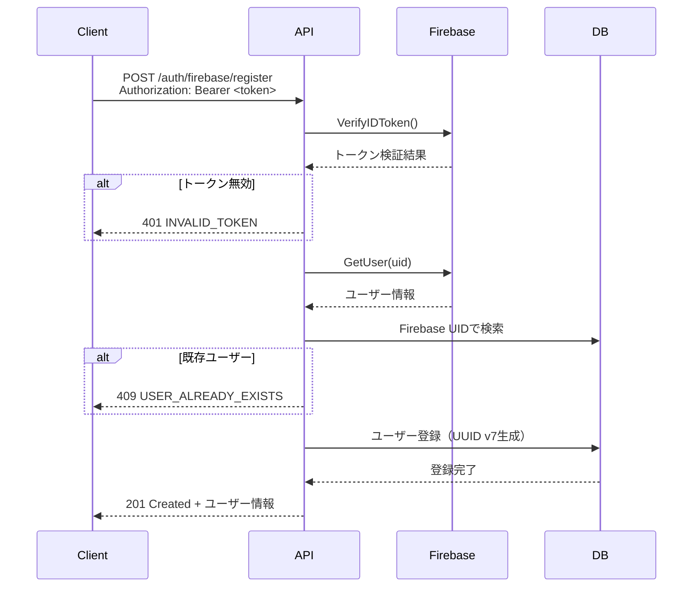
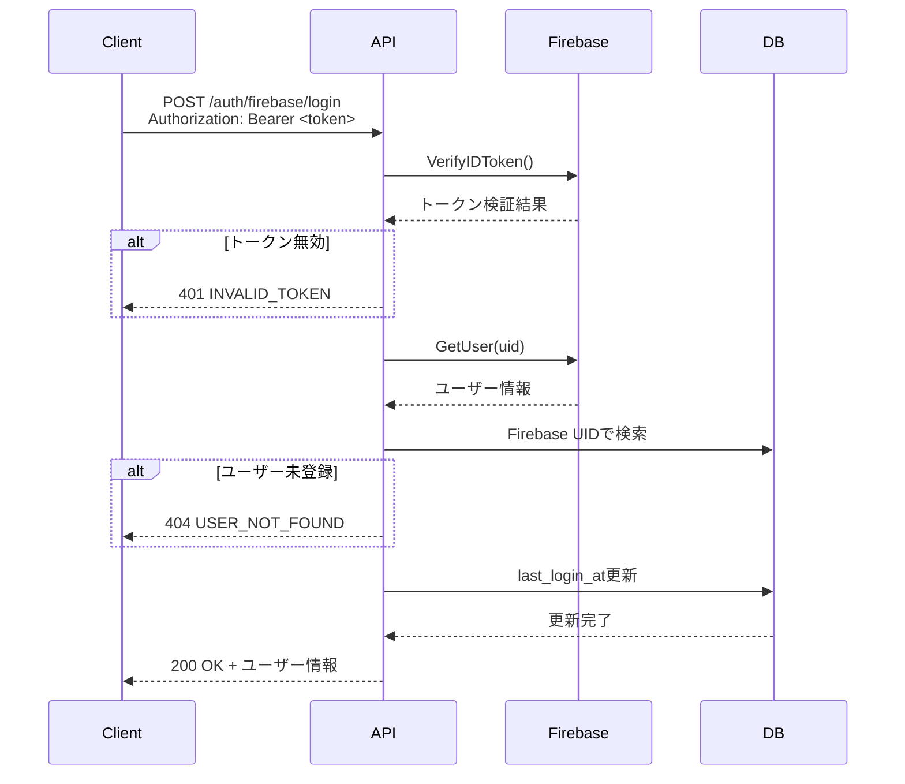

# エンドポイント設計

## 概要

managerサービスのREST APIエンドポイント設計を定義します。

## 基本仕様

- **ベースパス**: `/techcv/api/v1`
- **プロトコル**: HTTPS
- **データ形式**: JSON
- **文字コード**: UTF-8
- **日時形式**: ISO8601拡張形式（UTC、ミリ秒精度）
- **認証方式**: Firebase IDトークン（Bearer認証）

## 共通仕様

### リクエストヘッダー

| ヘッダー名 | 必須 | 説明 |
|-----------|------|------|
| Content-Type | Yes | application/json |
| Authorization | Conditional | Bearer <Firebase IDトークン>（認証が必要なエンドポイントのみ） |

### レスポンスヘッダー

| ヘッダー名 | 説明 |
|-----------|------|
| Content-Type | application/json |
| X-Request-ID | リクエストを一意に識別するID |

### エラーレスポンス形式

全てのエラーレスポンスは以下の統一フォーマットを使用します。

```json
{
  "requestId": "88374925",
  "code": "VALIDATION_ERROR",
  "details": [
    {
      "field": "email",
      "code": "INVALID_EMAIL_FORMAT"
    }
  ]
}
```

| フィールド | 型 | 必須 | 説明 |
|-----------|-----|------|------|
| requestId | string | Yes | リクエストを一意に識別するランダムID |
| code | string | No | エラーコード（大文字のスネークケース） |
| details | array | No | 詳細エラー情報の配列（主にバリデーションエラー用） |

### エラーコード一覧

| コード | HTTPステータス | 説明 |
|-------|---------------|------|
| INVALID_TOKEN | 401 | Firebase IDトークンが無効または期限切れ |
| USER_ALREADY_EXISTS | 409 | ユーザーが既に登録済み |
| USER_NOT_FOUND | 404 | ユーザーが見つからない |
| REGISTRATION_FAILED | 500 | ユーザー登録処理に失敗 |
| LOGIN_FAILED | 500 | ログイン処理に失敗 |
| INTERNAL_ERROR | 500 | 内部サーバーエラー |
| VALIDATION_ERROR | 400 | バリデーションエラー |

## 認証エンドポイント

### POST /auth/firebase/register

Firebase認証後のユーザー登録を行います。

#### 概要
- Firebase Authenticationで認証済みのユーザーをシステムに登録
- Firebase IDトークンからユーザー情報を取得してデータベースに保存
- 既に登録済みの場合は409エラーを返す

#### リクエスト

**エンドポイント**: `POST /techcv/api/v1/auth/firebase/register`

**認証**: 必須（Firebase IDトークン）

**ヘッダー**:
```
Authorization: Bearer <Firebase IDトークン>
Content-Type: application/json
```

**ボディ**: なし（Firebase IDトークンから全ての情報を取得）

#### レスポンス

**成功時（201 Created）**:
```json
{
  "userId": "01234567-89ab-cdef-0123-456789abcdef",
  "firebaseUid": "firebase-uid-string",
  "email": "user@example.com",
  "displayName": "User Name"
}
```

| フィールド | 型 | 説明 |
|-----------|-----|------|
| userId | string | アプリケーション内部のユーザーID（UUID v7） |
| firebaseUid | string | Firebase UID |
| email | string | メールアドレス |
| displayName | string | 表示名 |

**エラー時**:

| ステータス | コード | 説明 |
|-----------|--------|------|
| 401 | INVALID_TOKEN | Firebase IDトークンが無効 |
| 409 | USER_ALREADY_EXISTS | ユーザーが既に登録済み |
| 500 | REGISTRATION_FAILED | 登録処理に失敗 |
| 500 | INTERNAL_ERROR | 内部サーバーエラー |

#### 処理フロー



---

### POST /auth/firebase/login

Firebase認証後のログインを行います。

#### 概要
- Firebase Authenticationで認証済みのユーザーでログイン
- Firebase IDトークンからユーザー情報を取得
- 最終ログイン日時を更新
- 未登録の場合は404エラーを返す

#### リクエスト

**エンドポイント**: `POST /techcv/api/v1/auth/firebase/login`

**認証**: 必須（Firebase IDトークン）

**ヘッダー**:
```
Authorization: Bearer <Firebase IDトークン>
Content-Type: application/json
```

**ボディ**: なし（Firebase IDトークンから全ての情報を取得）

#### レスポンス

**成功時（200 OK）**:
```json
{
  "userId": "01234567-89ab-cdef-0123-456789abcdef",
  "firebaseUid": "firebase-uid-string",
  "email": "user@example.com",
  "displayName": "User Name"
}
```

| フィールド | 型 | 説明 |
|-----------|-----|------|
| userId | string | アプリケーション内部のユーザーID（UUID v7） |
| firebaseUid | string | Firebase UID |
| email | string | メールアドレス |
| displayName | string | 表示名 |

**エラー時**:

| ステータス | コード | 説明 |
|-----------|--------|------|
| 401 | INVALID_TOKEN | Firebase IDトークンが無効 |
| 404 | USER_NOT_FOUND | ユーザーが未登録 |
| 500 | LOGIN_FAILED | ログイン処理に失敗 |
| 500 | INTERNAL_ERROR | 内部サーバーエラー |

#### 処理フロー



## 認証ミドルウェア

認証が必要なエンドポイントでは、以下のミドルウェアが自動的に適用されます。

### 処理内容

1. **Authorizationヘッダーの確認**
   - ヘッダーが存在しない場合: 401エラー
   - フォーマットが不正な場合: 401エラー

2. **Firebase IDトークンの検証**
   - Firebase Admin SDKで署名検証
   - 有効期限の確認
   - issuer、audienceの確認
   - 検証失敗時: 401エラー

3. **コンテキストへの設定**
   - 検証成功後、Firebase UIDをリクエストコンテキストに設定
   - 後続の処理でFirebase UIDを利用可能

### エラーレスポンス

```json
{
  "requestId": "88374925",
  "code": "INVALID_TOKEN"
}
```

## OpenAPI定義

### セキュリティスキーム

```yaml
components:
  securitySchemes:
    BearerAuth:
      type: http
      scheme: bearer
      bearerFormat: JWT
      description: Firebase IDトークン
```

### パス定義

```yaml
paths:
  /auth/firebase/register:
    post:
      summary: Firebase認証後のユーザー登録
      tags:
        - Authentication
      security:
        - BearerAuth: []
      responses:
        '201':
          description: 登録成功
          content:
            application/json:
              schema:
                $ref: '#/components/schemas/RegisterResponse'
        '401':
          $ref: '#/components/responses/UnauthorizedError'
        '409':
          $ref: '#/components/responses/ConflictError'
        '500':
          $ref: '#/components/responses/InternalServerError'

  /auth/firebase/login:
    post:
      summary: Firebase認証後のログイン
      tags:
        - Authentication
      security:
        - BearerAuth: []
      responses:
        '200':
          description: ログイン成功
          content:
            application/json:
              schema:
                $ref: '#/components/schemas/RegisterResponse'
        '401':
          $ref: '#/components/responses/UnauthorizedError'
        '404':
          $ref: '#/components/responses/NotFoundError'
        '500':
          $ref: '#/components/responses/InternalServerError'
```

### スキーマ定義

```yaml
components:
  schemas:
    RegisterResponse:
      type: object
      required:
        - userId
        - firebaseUid
        - email
        - displayName
      properties:
        userId:
          type: string
          format: uuid
          description: アプリケーション内部のユーザーID
          example: "01234567-89ab-cdef-0123-456789abcdef"
        firebaseUid:
          type: string
          description: Firebase UID
          example: "firebase-uid-string"
        email:
          type: string
          format: email
          description: メールアドレス
          example: "user@example.com"
        displayName:
          type: string
          description: 表示名
          example: "User Name"

    ErrorResponse:
      type: object
      required:
        - requestId
      properties:
        requestId:
          type: string
          description: リクエストID
          example: "88374925"
        code:
          type: string
          description: エラーコード
          enum:
            - INVALID_TOKEN
            - USER_ALREADY_EXISTS
            - USER_NOT_FOUND
            - REGISTRATION_FAILED
            - LOGIN_FAILED
            - INTERNAL_ERROR
            - VALIDATION_ERROR
          example: "INVALID_TOKEN"
        details:
          type: array
          description: 詳細エラー情報
          items:
            type: object
            properties:
              field:
                type: string
                example: "email"
              code:
                type: string
                example: "INVALID_EMAIL_FORMAT"

  responses:
    UnauthorizedError:
      description: 認証エラー
      content:
        application/json:
          schema:
            $ref: '#/components/schemas/ErrorResponse'
          example:
            requestId: "88374925"
            code: "INVALID_TOKEN"

    ConflictError:
      description: リソースの競合
      content:
        application/json:
          schema:
            $ref: '#/components/schemas/ErrorResponse'
          example:
            requestId: "88374925"
            code: "USER_ALREADY_EXISTS"

    NotFoundError:
      description: リソースが見つからない
      content:
        application/json:
          schema:
            $ref: '#/components/schemas/ErrorResponse'
          example:
            requestId: "88374925"
            code: "USER_NOT_FOUND"

    InternalServerError:
      description: 内部サーバーエラー
      content:
        application/json:
          schema:
            $ref: '#/components/schemas/ErrorResponse'
          example:
            requestId: "88374925"
            code: "INTERNAL_ERROR"
```

## 非機能要件

### パフォーマンス
- Firebase IDトークンの検証: 100ms以内
- ユーザー登録処理: 3秒以内
- ログイン処理: 1秒以内

### セキュリティ
- 全ての通信はHTTPSで暗号化
- Firebase IDトークンは毎回検証
- トークンの有効期限は1時間（Firebase SDKが自動管理）

### ログ
- 全てのAPIリクエストをログに記録
- ログにはrequest_idを含める
- エラー時は詳細なスタックトレースを記録
- CloudLogging形式のJSON構造化ログ

### レート制限
- 将来的に実装を検討
- 同一IPからの過度なリクエストを制限
- 認証エンドポイントは特に厳格に制限

## 将来の拡張

### 追加予定のエンドポイント

1. **ユーザー情報取得**
   - `GET /users/me` - 自分のユーザー情報取得
   - `PATCH /users/me` - 自分のユーザー情報更新

2. **CV管理**
   - `GET /cvs` - CV一覧取得
   - `POST /cvs` - CV作成
   - `GET /cvs/{id}` - CV詳細取得
   - `PATCH /cvs/{id}` - CV更新
   - `DELETE /cvs/{id}` - CV削除

3. **管理者機能**
   - `GET /admin/users` - ユーザー一覧取得
   - `GET /admin/users/{id}` - ユーザー詳細取得
   - `PATCH /admin/users/{id}` - ユーザー情報更新
   - `DELETE /admin/users/{id}` - ユーザー削除
