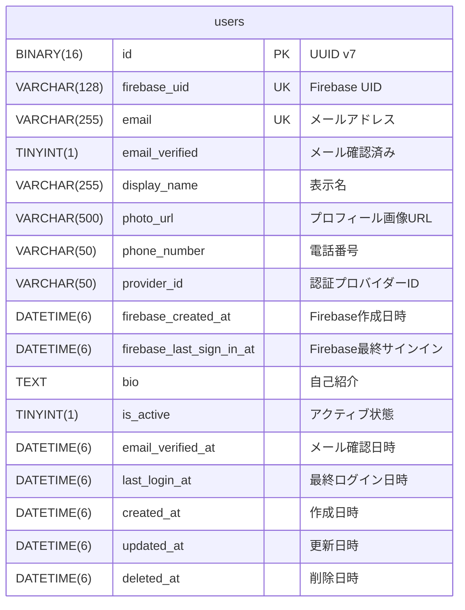

# データベース論理設計

## 概要

managerサービスのデータベース論理設計を定義します。

## データベース仕様

- **RDBMS**: MySQL 8.0+
- **文字コード**: utf8mb4
- **照合順序**: utf8mb4_unicode_ci
- **ストレージエンジン**: InnoDB
- **タイムゾーン**: UTC
- **日時精度**: マイクロ秒（DATETIME(6)）

## テーブル一覧

| テーブル名 | 論理名 | 説明 |
|-----------|--------|------|
| users | ユーザー | システムを利用するユーザーの情報 |

## テーブル定義

### users（ユーザー）

Firebase Authenticationで認証されたユーザーの情報を管理するテーブル。

#### カラム定義

| カラム名 | 型 | NULL | デフォルト | 説明 |
|---------|-----|------|-----------|------|
| id | BINARY(16) | NOT NULL | - | UUID v7（アプリケーション内部ID） |
| firebase_uid | VARCHAR(128) | NOT NULL | - | Firebase UID |
| email | VARCHAR(255) | NOT NULL | - | メールアドレス |
| email_verified | TINYINT(1) | NOT NULL | 0 | メール確認済みフラグ（Firebaseから取得） |
| display_name | VARCHAR(255) | NULL | - | 表示名（Firebaseから取得） |
| photo_url | VARCHAR(500) | NULL | - | プロフィール画像URL（Firebaseから取得） |
| phone_number | VARCHAR(50) | NULL | - | 電話番号（Firebaseから取得、オプション） |
| provider_id | VARCHAR(50) | NOT NULL | - | 認証プロバイダーID（例: google.com） |
| firebase_created_at | DATETIME(6) | NULL | - | Firebase上のアカウント作成日時 |
| firebase_last_sign_in_at | DATETIME(6) | NULL | - | Firebase上の最終サインイン日時 |
| bio | TEXT | NULL | - | 自己紹介（アプリケーション独自項目） |
| is_active | TINYINT(1) | NOT NULL | 1 | アクティブ状態 |
| email_verified_at | DATETIME(6) | NULL | - | メール確認日時（アプリケーション側で管理） |
| last_login_at | DATETIME(6) | NULL | - | 最終ログイン日時（アプリケーション側で管理） |
| created_at | DATETIME(6) | NOT NULL | CURRENT_TIMESTAMP(6) | 作成日時 |
| updated_at | DATETIME(6) | NOT NULL | CURRENT_TIMESTAMP(6) ON UPDATE | 更新日時 |
| deleted_at | DATETIME(6) | NULL | - | 削除日時（論理削除用） |

#### 制約

**主キー**
- PRIMARY KEY (id)

**ユニーク制約**
- UNIQUE KEY uq_users_email (email)
- UNIQUE KEY uq_users_firebase_uid (firebase_uid)

**インデックス**
- INDEX idx_users_firebase_uid (firebase_uid) - Firebase UIDでの高速検索
- INDEX idx_users_provider_id (provider_id) - 認証プロバイダーでの検索
- INDEX idx_users_deleted_at (deleted_at) - 論理削除クエリの最適化

#### DDL

```sql
CREATE TABLE users (
    id BINARY(16) PRIMARY KEY COMMENT 'UUID v7（アプリケーション内部ID）',
    firebase_uid VARCHAR(128) NOT NULL UNIQUE COMMENT 'Firebase UID',
    email VARCHAR(255) NOT NULL UNIQUE COMMENT 'メールアドレス',
    email_verified TINYINT(1) NOT NULL DEFAULT 0 COMMENT 'メール確認済みフラグ（Firebaseから取得）',
    display_name VARCHAR(255) COMMENT '表示名（Firebaseから取得）',
    photo_url VARCHAR(500) COMMENT 'プロフィール画像URL（Firebaseから取得）',
    phone_number VARCHAR(50) COMMENT '電話番号（Firebaseから取得、オプション）',
    provider_id VARCHAR(50) NOT NULL COMMENT '認証プロバイダーID（例: google.com）',
    firebase_created_at DATETIME(6) COMMENT 'Firebase上のアカウント作成日時',
    firebase_last_sign_in_at DATETIME(6) COMMENT 'Firebase上の最終サインイン日時',
    bio TEXT COMMENT '自己紹介（アプリケーション独自項目）',
    is_active TINYINT(1) NOT NULL DEFAULT 1 COMMENT 'アクティブ状態',
    email_verified_at DATETIME(6) COMMENT 'メール確認日時（アプリケーション側で管理）',
    last_login_at DATETIME(6) COMMENT '最終ログイン日時（アプリケーション側で管理）',
    created_at DATETIME(6) NOT NULL DEFAULT CURRENT_TIMESTAMP(6) COMMENT '作成日時',
    updated_at DATETIME(6) NOT NULL DEFAULT CURRENT_TIMESTAMP(6) ON UPDATE CURRENT_TIMESTAMP(6) COMMENT '更新日時',
    deleted_at DATETIME(6) COMMENT '削除日時（論理削除用）',
    
    UNIQUE KEY uq_users_email (email),
    UNIQUE KEY uq_users_firebase_uid (firebase_uid),
    INDEX idx_users_firebase_uid (firebase_uid),
    INDEX idx_users_provider_id (provider_id),
    INDEX idx_users_deleted_at (deleted_at)
) ENGINE=InnoDB DEFAULT CHARSET=utf8mb4 COLLATE=utf8mb4_unicode_ci COMMENT='ユーザー情報';
```

## ER図



## データ型の選定理由

### ID（BINARY(16)）
- UUID v7を使用することで、時系列順序性とグローバル一意性を両立
- BINARY(16)で格納することでストレージ効率を最適化（文字列の36バイトに対して16バイト）

### firebase_uid（VARCHAR(128)）
- Firebase UIDの最大長を考慮
- ユニーク制約により重複登録を防止

### email（VARCHAR(255)）
- RFC 5321に準拠した最大長
- ユニーク制約により同一メールアドレスでの重複登録を防止

### DATETIME(6)
- マイクロ秒精度で時刻を記録
- UTCで統一して保存
- ISO8601形式での入出力

### TINYINT(1)
- boolean値の表現（0 = false, 1 = true）
- MySQLのBOOLEAN型はTINYINT(1)のエイリアス

### TEXT
- 可変長の長文データ（bio等）
- 最大65,535バイト

## インデックス設計

### idx_users_firebase_uid
- **目的**: Firebase UIDでのユーザー検索の高速化
- **使用場面**: ログイン時、認証ミドルウェアでのユーザー特定
- **カーディナリティ**: 高（ユニーク値）

### idx_users_provider_id
- **目的**: 認証プロバイダーごとのユーザー検索
- **使用場面**: 将来的な複数プロバイダー対応時の分析・管理
- **カーディナリティ**: 低〜中（プロバイダー数に依存）

### idx_users_deleted_at
- **目的**: 論理削除されていないユーザーの検索最適化
- **使用場面**: ほぼ全てのクエリ（WHERE deleted_at IS NULL）
- **カーディナリティ**: 低（NULL or 削除日時）

## 論理削除

### 方針
- 物理削除は行わず、deleted_atカラムで論理削除を実現
- deleted_atがNULLの場合は有効なレコード
- deleted_atに日時が入っている場合は削除済み

### 理由
- ユーザーデータの履歴保持
- 誤削除時の復旧可能性
- 監査証跡の維持

### クエリ例
```sql
-- 有効なユーザーのみ取得
SELECT * FROM users WHERE deleted_at IS NULL;

-- 論理削除
UPDATE users SET deleted_at = NOW(), updated_at = NOW() WHERE id = ?;
```

## 将来の拡張性

### 複数認証プロバイダー対応
現在はFirebase Authenticationのみだが、将来的に以下のような拡張が可能：

1. **provider_idの活用**
   - google.com（Google）
   - github.com（GitHub）
   - microsoft.com（Microsoft）
   - 等の識別が可能

2. **スキーマ変更不要**
   - firebase_uidで全プロバイダーを統一管理
   - 追加のテーブルやカラムは不要

### パフォーマンス考慮事項

1. **インデックスの効果測定**
   - 定期的にEXPLAINでクエリプランを確認
   - スロークエリログの監視

2. **パーティショニング**
   - ユーザー数が数百万を超える場合は検討
   - created_atやprovider_idでのパーティション分割

3. **アーカイブ戦略**
   - 長期間ログインのないユーザーのアーカイブ
   - deleted_atから一定期間経過後の物理削除
